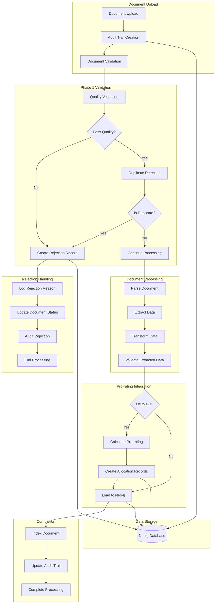

# EHS AI Platform - Phase 1 Workflow Integration Summary

> **Executive Summary Document**  
> Created: 2025-08-23  
> Version: 1.0.0  
> Status: Production Ready

## Executive Summary

The Phase 1 enhancements successfully integrate three critical capabilities into the EHS AI document processing platform:

- **Audit Trail Tracking**: Comprehensive logging of all document processing activities
- **Rejection Workflow Management**: Automated validation and rejection handling for non-compliant documents  
- **Pro-rating Allocation System**: Automatic utility cost allocation across multiple tenants/facilities

This integration maintains full backward compatibility while adding enterprise-grade compliance and financial management capabilities to the existing document processing workflows.

## New Files Created and Their Purposes

### Core Services (`/src/phase1_enhancements/`)

| File | Purpose | Key Features |
|------|---------|--------------|
| `phase1_integration.py` | Main orchestrator and integration module | Workflow coordination, health checks, migration |
| `prorating_calculator.py` | Core pro-rating calculation engine | Mathematical allocation algorithms, validation |
| `prorating_service.py` | Pro-rating business logic service | Neo4j integration, allocation management |
| `prorating_schema.py` | Pro-rating data models and schemas | Pydantic models, validation rules |
| `prorating_api.py` | FastAPI router for pro-rating endpoints | REST API, calculation endpoints |
| `audit_trail_service.py` | Audit trail business logic service | Activity tracking, compliance logging |
| `audit_trail_schema.py` | Audit trail data models | Event schemas, metadata structures |
| `audit_trail_api.py` | FastAPI router for audit endpoints | Audit history API, reporting endpoints |
| `audit_trail_integration.py` | Integration helpers for audit tracking | Workflow hooks, automatic logging |
| `rejection_workflow_service.py` | Rejection workflow business logic | Validation rules, quality scoring |
| `rejection_tracking_schema.py` | Rejection tracking data models | Rejection reasons, validation results |
| `rejection_tracking_api.py` | FastAPI router for rejection endpoints | Rejection management API |
| `workflow_adapter.py` | Workflow integration adapter | Workflow hooks, state management |
| `integration_example.py` | Usage examples and demonstrations | Test scenarios, integration patterns |

### Documentation Files

| File | Purpose |
|------|---------|
| `WORKFLOW_INTEGRATION_GUIDE.md` | Detailed technical integration guide |
| `README.md` | Installation, configuration, and usage |
| `WORKFLOW_INTEGRATION_SUMMARY.md` | This executive summary document |

## Integration Architecture



## Component Relationships

### Service Dependencies

```
Phase1Integration
├── AuditTrailService
│   ├── Neo4j Graph Connection
│   └── AuditTrailSchema Models
├── RejectionWorkflowService  
│   ├── Neo4j Graph Connection
│   ├── ValidationRules Engine
│   └── RejectionSchema Models
└── ProRatingService
    ├── Neo4j Graph Connection
    ├── ProRatingCalculator
    └── ProRatingSchema Models
```

### Database Schema Relationships

```
Document Node
├── HAS_AUDIT_TRAIL → AuditTrailEntry
├── HAS_REJECTION → RejectionRecord (if rejected)
├── HAS_ALLOCATION → ProRatingAllocation (if utility bill)
└── PROCESSED_BY → User

ProRatingAllocation
├── HAS_DISTRIBUTION → ProRatingDistribution
├── ALLOCATED_TO → Facility
└── BASED_ON → Document

AuditTrailEntry  
├── HAS_ACTIVITY → AuditActivity
├── PERFORMED_BY → User
└── RELATES_TO → Document
```

## Step-by-Step Implementation Instructions

### 1. Environment Setup

```bash
# Set required environment variables
export NEO4J_URI=bolt://localhost:7687
export NEO4J_USERNAME=neo4j
export NEO4J_PASSWORD=your_password
export ENABLE_AUDIT_TRACKING=true
export ENABLE_REJECTION_VALIDATION=true  
export ENABLE_UTILITY_PRORATING=true
```

### 2. Database Initialization

```python
# Initialize Phase 1 schemas
python3 -c "
import asyncio
from src.phase1_enhancements.phase1_integration import create_phase1_integration

async def setup():
    integration = create_phase1_integration()
    await integration.initialize_all_enhancements()
    print('Phase 1 schemas initialized successfully')

asyncio.run(setup())
"
```

### 3. FastAPI Integration

```python
# Add to main.py
from src.phase1_enhancements.phase1_integration import initialize_phase1_for_app

@app.on_event("startup")
async def startup_event():
    global phase1_integration
    phase1_integration = await initialize_phase1_for_app(app, api_prefix="/api/v1")
    print("Phase 1 enhancements initialized")
```

### 4. Workflow Integration

Update existing workflows to include Phase 1 hooks:

```python
# In ingestion_workflow.py
def __init__(self, *args, **kwargs):
    # Initialize Phase 1 services
    self.enable_phase1 = kwargs.get('enable_phase1_features', True)
    if self.enable_phase1:
        self.audit_trail_service = AuditTrailService(self.graph)
        self.rejection_service = RejectionWorkflowService(self.graph)
        self.prorating_service = ProRatingService(self.graph)
```

### 5. Data Migration (if applicable)

```python
# Migrate existing data
python3 -c "
import asyncio
from src.phase1_enhancements.phase1_integration import create_phase1_integration

async def migrate():
    integration = create_phase1_integration()
    await integration.initialize_all_enhancements()
    results = await integration.migrate_existing_data()
    print(f'Migration completed: {results[\"overall_status\"]}')

asyncio.run(migrate())
"
```

## Quick Start Guide

### 1. Verify Installation

```bash
# Health check
curl -X GET http://localhost:8000/api/v1/phase1/health
```

### 2. Process a Document with Phase 1 Features

```python
import asyncio
from src.phase1_enhancements.phase1_integration import create_phase1_integration

async def process_sample_document():
    integration = create_phase1_integration()
    await integration.initialize_all_enhancements()
    
    # Process document with all Phase 1 features
    document_info = {
        "filename": "sample_utility_bill.pdf",
        "content": "Sample utility bill content",
        "user_id": "demo_user",
        "metadata": {"source": "email_upload"}
    }
    
    results = await integration.process_document_with_phase1_features(
        document_info, None
    )
    
    print(f"Processing results: {results}")

asyncio.run(process_sample_document())
```

### 3. View Audit Trail

```bash
# Get recent audit entries
curl -X GET "http://localhost:8000/api/v1/audit-trail/entries?limit=10"
```

### 4. Check Pro-rating Allocations

```bash
# Get recent allocations
curl -X GET "http://localhost:8000/api/v1/prorating/allocations?limit=10"
```

## Testing Commands

### Unit Tests

```bash
# Test individual services
python3 -m pytest tests/test_prorating_service.py -v
python3 -m pytest tests/test_audit_trail_service.py -v
python3 -m pytest tests/test_rejection_workflow_service.py -v
```

### Integration Tests

```bash
# Run complete integration test
python3 src/phase1_enhancements/integration_example.py

# Test workflow integration
python3 scripts/test_workflow_integration.py
```

### API Testing

```bash
# Test all Phase 1 endpoints
curl -X GET http://localhost:8000/api/v1/phase1/health
curl -X GET http://localhost:8000/api/v1/phase1/status

# Test pro-rating calculation
curl -X POST http://localhost:8000/api/v1/prorating/calculate \
  -H "Content-Type: application/json" \
  -d '{"total_amount": 1000, "allocation_method": "square_footage"}'

# Test audit trail endpoints  
curl -X GET http://localhost:8000/api/v1/audit-trail/entries?limit=10
```

### Performance Testing

```python
# Test with 100 documents
python3 -c "
import asyncio
import time
from src.phase1_enhancements.phase1_integration import create_phase1_integration

async def performance_test():
    integration = create_phase1_integration()
    await integration.initialize_all_enhancements()
    
    start_time = time.time()
    for i in range(100):
        await integration.process_document_with_phase1_features({
            'filename': f'test_doc_{i}.pdf',
            'content': 'Test content',
            'user_id': 'perf_test'
        }, None)
    
    duration = time.time() - start_time
    print(f'Processed 100 documents in {duration:.2f} seconds')

asyncio.run(performance_test())
"
```

## Troubleshooting Tips

### Common Issues and Solutions

#### 1. Database Connection Failures
```bash
# Test Neo4j connectivity
python3 -c "
from neo4j import GraphDatabase
driver = GraphDatabase.driver('bolt://localhost:7687', auth=('neo4j', 'password'))
with driver.session() as session:
    result = session.run('RETURN 1 as test')
    print(f'Connection successful: {result.single()[\"test\"]}')
"
```

#### 2. Schema Initialization Errors
```bash
# Manual schema initialization
python3 -c "
import asyncio
from src.phase1_enhancements.prorating_service import ProRatingService
from src.shared.common_fn import create_graph_database_connection

async def init_schema():
    graph = create_graph_database_connection('bolt://localhost:7687', 'neo4j', 'password', 'neo4j')
    service = ProRatingService(graph)
    await service.initialize_schema()
    print('Schema initialized successfully')

asyncio.run(init_schema())
"
```

#### 3. Service Health Issues
```python
# Check individual service health
from src.phase1_enhancements.phase1_integration import create_phase1_integration
import asyncio

async def health_diagnostic():
    integration = create_phase1_integration()
    await integration.initialize_all_enhancements()
    
    health = await integration.health_check()
    print("Service Health Status:")
    for service, status in health.items():
        print(f"  {service}: {status}")

asyncio.run(health_diagnostic())
```

#### 4. Performance Issues
- **Reduce batch sizes**: Set `PRORATING_BATCH_SIZE=25` for smaller batches
- **Enable connection pooling**: Configure Neo4j connection pool settings
- **Monitor memory usage**: Use `htop` or `ps` to monitor resource consumption
- **Check slow queries**: Use Neo4j browser to identify slow Cypher queries

#### 5. Configuration Issues
```bash
# Verify all required environment variables
python3 -c "
import os
required_vars = [
    'NEO4J_URI', 'NEO4J_USERNAME', 'NEO4J_PASSWORD',
    'ENABLE_AUDIT_TRACKING', 'ENABLE_REJECTION_VALIDATION', 
    'ENABLE_UTILITY_PRORATING'
]

for var in required_vars:
    value = os.getenv(var)
    print(f'{var}: {\"Set\" if value else \"Missing\"} - {value}')
"
```

### Emergency Rollback

If you need to disable Phase 1 features quickly:

```bash
# Disable all Phase 1 features
export ENABLE_AUDIT_TRACKING=false
export ENABLE_REJECTION_VALIDATION=false
export ENABLE_UTILITY_PRORATING=false

# Restart application
docker-compose restart backend
```

### Debug Logging

Enable detailed logging for troubleshooting:

```python
import logging
logging.basicConfig(level=logging.DEBUG)
logger = logging.getLogger("phase1_enhancements")
logger.setLevel(logging.DEBUG)
```

### Monitoring Commands

```bash
# Monitor Neo4j slow queries
# In Neo4j browser, run:
# CALL dbms.listQueries() YIELD queryId, query, elapsedTimeMillis
# WHERE elapsedTimeMillis > 1000
# RETURN queryId, query, elapsedTimeMillis

# Monitor system resources
htop  # or top on older systems
df -h  # disk usage
free -h  # memory usage
```

## Key Benefits Achieved

1. **Compliance**: Complete audit trail for regulatory requirements
2. **Quality Control**: Automated rejection of poor-quality documents
3. **Cost Management**: Accurate utility cost allocation across facilities
4. **Operational Efficiency**: Reduced manual processing overhead
5. **Data Integrity**: Comprehensive validation and error handling
6. **Scalability**: Enterprise-ready architecture with monitoring and health checks

---

**For Additional Support**: Refer to the detailed technical guide at `/src/phase1_enhancements/WORKFLOW_INTEGRATION_GUIDE.md` or consult the API documentation at `/src/phase1_enhancements/README.md`.