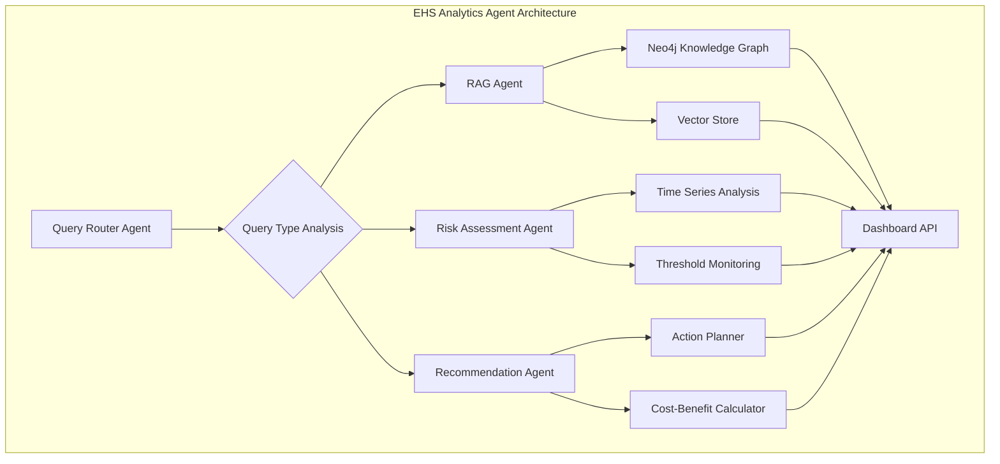

# EHS Analytics Agent Implementation Plan

## Executive Summary

The EHS Analytics Agent represents a state-of-the-art AI system designed to transform Environmental, Health, and Safety (EHS) data management from reactive compliance to proactive intelligence. Built on a modern tech stack including LangGraph, LangChain, Neo4j, and LlamaIndex, this agent provides two core capabilities:

1. **Agentic RAG System**: Intelligent document retrieval and analysis with dynamic strategy selection for complex EHS queries
2. **Risk Assessment and Recommendations Engine**: Predictive analytics for environmental compliance risks with actionable mitigation strategies

### Key Capabilities

- **Automated EHS Data Ingestion**: Extract structured data from utility bills, permits, waste manifests, and compliance documents
- **Multi-Modal Retrieval**: Combine vector similarity, graph traversal, and temporal analysis for comprehensive insights
- **Predictive Risk Assessment**: Identify potential compliance violations before they occur
- **Actionable Recommendations**: Generate specific, data-driven mitigation strategies
- **Audit-Ready Documentation**: Maintain full traceability of decisions and recommendations

### Integration with Data Foundation

The EHS Analytics Agent builds upon the existing data-foundation project, leveraging its Neo4j knowledge graph, document processing pipeline, and FastAPI backend. The agent serves as an intelligent layer that transforms raw EHS data into strategic business intelligence.

## Architecture Overview

The EHS Analytics Agent follows a multi-agent architecture orchestrated by LangGraph, with specialized agents handling different aspects of EHS analytics.

### Core Components



### Technology Stack Integration

- **LangGraph**: Agent orchestration and workflow management
- **LangChain**: LLM interactions, prompt management, and tool usage
- **Neo4j**: Knowledge graph storage and graph-based queries
- **neo4j-graphrag-python**: Production-ready retrievers for GraphRAG implementation
  - Provides 5 retriever types: Vector, Hybrid, Text2Cypher, VectorCypher, HybridCypher
  - Built-in entity extraction and knowledge graph construction
  - Seamless integration with LangChain
  - Support for external vector stores (Pinecone, Weaviate, Qdrant)
- **LlamaIndex**: Document indexing and vector similarity search
- **LlamaParse**: Structured document parsing
- **FastAPI**: REST API for dashboard integration
- **Pydantic**: Data validation and serialization

## Agentic RAG System

The Agentic RAG system intelligently selects and combines multiple retrieval strategies based on query analysis and context.

### Dynamic Retrieval Strategy Selection

The Query Router Agent analyzes incoming queries and determines the optimal retrieval approach:

#### Query Classification

```python
class QueryType(Enum):
    FACILITY_SPECIFIC = "facility_specific"      # "What is the water usage at Plant A?"
    TREND_ANALYSIS = "trend_analysis"            # "How has energy consumption changed?"
    COMPLIANCE_STATUS = "compliance_status"       # "Are we meeting permit requirements?"
    COMPARATIVE = "comparative"                   # "Compare facilities by waste generation"
    PREDICTIVE = "predictive"                    # "Will we exceed limits next quarter?"
    DOCUMENT_SEARCH = "document_search"          # "Find permits expiring in 2024"
    RELATIONSHIP = "relationship"                # "How does equipment affect consumption?"
```

#### Strategy Selection Logic

1. **Query Understanding**: Natural language processing to extract intent, entities, and temporal context
2. **Context Analysis**: Evaluate available data sources and relationships
3. **Strategy Ranking**: Score strategies based on query type and data availability
4. **Multi-Strategy Combination**: Combine strategies when beneficial

### Retrieval Strategies Using neo4j-graphrag-python

The neo4j-graphrag-python library provides production-ready retrievers that significantly simplify our implementation while providing sophisticated retrieval capabilities.

#### 1. Text2Cypher Retriever (Replaces Direct Neo4j Queries)

**Use Case**: Natural language to structured graph queries

**Implementation**:
```python
from neo4j_graphrag.retrievers import Text2CypherRetriever
from neo4j_graphrag.llm import OpenAILLM

class EHSText2CypherStrategy:
    def __init__(self, driver, llm):
        # Neo4j schema for EHS domain
        self.neo4j_schema = """
        Node properties:
        - Facility: id, name, location, type
        - UtilityBill: id, facility_id, utility_type, usage, period_start, period_end, cost
        - Permit: id, facility_id, permit_type, limit, expiration_date
        - Equipment: id, facility_id, equipment_type, efficiency_rating
        
        Relationships:
        - (UtilityBill)-[:BILLED_TO]->(Facility)
        - (Permit)-[:PERMITS]->(Facility)
        - (Equipment)-[:LOCATED_AT]->(Facility)
        """
        
        self.retriever = Text2CypherRetriever(
            driver=driver,
            llm=llm,
            neo4j_schema=self.neo4j_schema,
            examples=[
                {
                    "question": "What is the water usage at Plant A?",
                    "cypher": "MATCH (f:Facility {name: 'Plant A'})<-[:BILLED_TO]-(b:UtilityBill {utility_type: 'water'}) RETURN b.usage, b.period_start"
                },
                {
                    "question": "Which facilities exceeded their permit limits?",
                    "cypher": "MATCH (f:Facility)<-[:PERMITS]-(p:Permit) WHERE f.current_usage > p.limit RETURN f.name, f.current_usage, p.limit"
                }
            ]
        )
    
    def execute(self, query: str) -> List[Document]:
        return self.retriever.search(query_text=query, top_k=10)
```

**EHS-Specific Applications**:
- Facility metrics queries: "What is the electricity consumption at Shanghai facility?"
- Compliance checks: "Which facilities are approaching their water permit limits?"
- Equipment analysis: "Show equipment efficiency ratings at facilities with high energy usage"

#### 2. Vector Retriever

**Use Case**: Semantic similarity search for documents and compliance texts

**Implementation**:
```python
from neo4j_graphrag.retrievers import VectorRetriever
from neo4j_graphrag.embeddings import OpenAIEmbeddings

class EHSVectorStrategy:
    def __init__(self, driver):
        self.embedder = OpenAIEmbeddings(model="text-embedding-3-small")
        
        self.retriever = VectorRetriever(
            driver=driver,
            index_name="ehs_document_embeddings",
            embedder=self.embedder,
            return_properties=["text", "document_type", "facility_id", "date"]
        )
    
    def execute(self, query: str, filters: Dict = None) -> List[Document]:
        # Apply EHS-specific filters
        if filters:
            search_params = {
                "query_text": query,
                "top_k": 20,
                "filters": filters  # e.g., {"document_type": "permit", "facility_id": "PLANT_A"}
            }
        else:
            search_params = {"query_text": query, "top_k": 20}
            
        return self.retriever.search(**search_params)
```

**EHS Applications**:
- Regulatory compliance search: "Find all water quality monitoring requirements"
- Best practices retrieval: "Energy efficiency improvements for cooling towers"
- Similar incident analysis: "Previous cases of permit limit exceedances"

#### 3. Hybrid Retriever

**Use Case**: Combined semantic and keyword search for comprehensive results

**Implementation**:
```python
from neo4j_graphrag.retrievers import HybridRetriever

class EHSHybridStrategy:
    def __init__(self, driver):
        self.embedder = OpenAIEmbeddings(model="text-embedding-3-small")
        
        self.retriever = HybridRetriever(
            driver=driver,
            vector_index_name="ehs_document_embeddings",
            fulltext_index_name="ehs_document_fulltext",
            embedder=self.embedder,
            return_properties=["text", "document_type", "facility_id", "date", "keywords"]
        )
    
    def execute(self, query: str, vector_weight: float = 0.5) -> List[Document]:
        # Balance between semantic and keyword matching
        return self.retriever.search(
            query_text=query,
            top_k=20,
            vector_weight=vector_weight,  # 0.5 = equal weight to vector and fulltext
            fulltext_weight=1.0 - vector_weight
        )
```

**EHS Applications**:
- Waste manifest search: Combine semantic understanding with specific waste codes
- Regulatory updates: Match both concept similarity and specific regulation numbers
- Incident reports: Find similar incidents with specific chemical names

#### 4. VectorCypher Retriever (Relationship-Aware Search)

**Use Case**: Combine vector similarity with graph traversal for context-aware retrieval

**Implementation**:
```python
from neo4j_graphrag.retrievers import VectorCypherRetriever

class EHSVectorCypherStrategy:
    def __init__(self, driver, llm):
        self.embedder = OpenAIEmbeddings(model="text-embedding-3-small")
        
        # Cypher query template for relationship traversal
        self.retrieval_query = """
        MATCH (node)-[:RELATED_TO*1..2]-(connected)
        WHERE node.embedding IS NOT NULL
        AND connected.facility_id IN $facility_ids
        RETURN node, connected, 
               [rel in relationships(path) | type(rel)] as relationship_types
        """
        
        self.retriever = VectorCypherRetriever(
            driver=driver,
            index_name="ehs_embeddings",
            embedder=self.embedder,
            retrieval_query=self.retrieval_query,
            llm=llm
        )
    
    def execute(self, query: str, facility_ids: List[str] = None) -> List[Document]:
        params = {"facility_ids": facility_ids} if facility_ids else {}
        return self.retriever.search(query_text=query, top_k=15, params=params)
```

**EHS Applications**:
- Impact analysis: "How will equipment maintenance affect water consumption?"
- Root cause analysis: "What factors contribute to energy spikes at Plant B?"
- Cross-facility patterns: "Find similar compliance issues across facilities"

#### 5. HybridCypher Retriever (Ultimate Flexibility)

**Use Case**: Combine all retrieval approaches with custom Cypher for complex EHS queries

**Implementation**:
```python
from neo4j_graphrag.retrievers import HybridCypherRetriever

class EHSHybridCypherStrategy:
    def __init__(self, driver, llm):
        self.embedder = OpenAIEmbeddings(model="text-embedding-3-small")
        
        # Complex retrieval query for temporal and relationship analysis
        self.retrieval_query = """
        // Temporal pattern matching
        MATCH (f:Facility)-[:HAS_BILL]->(b:UtilityBill)
        WHERE b.period_start >= $start_date AND b.period_end <= $end_date
        WITH f, b, 
             avg(b.usage) as avg_usage,
             stdev(b.usage) as usage_stdev
        
        // Relationship traversal
        MATCH (f)-[:HAS_EQUIPMENT]->(e:Equipment)
        WHERE e.efficiency_rating < $efficiency_threshold
        
        // Combine with vector similarity results
        WITH f, b, e, avg_usage, usage_stdev, node as similar_doc
        RETURN f, b, e, similar_doc,
               avg_usage, usage_stdev,
               (b.usage - avg_usage) / usage_stdev as anomaly_score
        ORDER BY anomaly_score DESC
        """
        
        self.retriever = HybridCypherRetriever(
            driver=driver,
            vector_index_name="ehs_embeddings",
            fulltext_index_name="ehs_fulltext",
            embedder=self.embedder,
            retrieval_query=self.retrieval_query,
            llm=llm
        )
    
    def execute(self, query: str, time_range: Dict, thresholds: Dict) -> List[Document]:
        params = {
            "start_date": time_range.get("start"),
            "end_date": time_range.get("end"),
            "efficiency_threshold": thresholds.get("efficiency", 0.8)
        }
        return self.retriever.search(
            query_text=query,
            top_k=25,
            params=params,
            vector_weight=0.4,
            fulltext_weight=0.2
            # Remaining 0.4 weight goes to Cypher query results
        )
```

**EHS Applications**:
- Comprehensive facility analysis: "Analyze water usage anomalies at facilities with old equipment"
- Multi-factor risk assessment: "Find facilities with both compliance issues and efficiency problems"
- Temporal pattern detection: "Identify seasonal consumption patterns across all facilities"

### Strategy Orchestration with neo4j-graphrag-python

The RAG Agent leverages neo4j-graphrag-python's GraphRAG pipeline with LangGraph for intelligent orchestration:

```python
from neo4j_graphrag.generation import GraphRAG
from langchain.graphs import Neo4jGraph
from langgraph.graph import StateGraph

class EHSRAGWorkflow:
    def __init__(self, driver, llm):
        # Initialize all retrievers
        self.text2cypher = EHSText2CypherStrategy(driver, llm)
        self.vector = EHSVectorStrategy(driver)
        self.hybrid = EHSHybridStrategy(driver)
        self.vector_cypher = EHSVectorCypherStrategy(driver, llm)
        self.hybrid_cypher = EHSHybridCypherStrategy(driver, llm)
        
        # GraphRAG pipeline for response generation
        self.graphrag = GraphRAG(
            retriever=None,  # We'll set this dynamically
            llm=llm
        )
        
        # LangGraph workflow
        self.workflow = StateGraph(RAGState)
        self.workflow.add_node("query_analysis", self.analyze_query)
        self.workflow.add_node("strategy_selection", self.select_optimal_retriever)
        self.workflow.add_node("retrieval", self.execute_retrieval)
        self.workflow.add_node("response_generation", self.generate_response)
        
    def select_optimal_retriever(self, state: RAGState):
        """Select the best retriever based on query type"""
        query_type = state["query_type"]
        
        retriever_map = {
            QueryType.FACILITY_SPECIFIC: self.text2cypher,
            QueryType.DOCUMENT_SEARCH: self.vector,
            QueryType.COMPLIANCE_STATUS: self.hybrid,
            QueryType.RELATIONSHIP: self.vector_cypher,
            QueryType.TREND_ANALYSIS: self.hybrid_cypher,
            QueryType.COMPARATIVE: self.hybrid_cypher,
            QueryType.PREDICTIVE: self.hybrid_cypher
        }
        
        state["selected_retriever"] = retriever_map.get(query_type, self.hybrid)
        return state
    
    def execute_retrieval(self, state: RAGState):
        """Execute retrieval using selected strategy"""
        retriever = state["selected_retriever"]
        results = retriever.execute(
            query=state["query"],
            **state.get("retrieval_params", {})
        )
        state["retrieval_results"] = results
        return state
    
    def generate_response(self, state: RAGState):
        """Generate final response using GraphRAG"""
        self.graphrag.retriever = state["selected_retriever"].retriever
        response = self.graphrag.search(
            query=state["query"],
            retriever_config={"top_k": 10}
        )
        state["response"] = response
        return state
```

## Risk Assessment Engine

The Risk Assessment Engine proactively identifies potential compliance violations and environmental risks using predictive analytics and threshold monitoring.

### Risk Identification Algorithms

#### 1. Water Consumption Anomaly Detection

**Objective**: Identify facilities at risk of exceeding water withdrawal permits

**Algorithm**:
```python
class WaterRiskAssessment:
    def __init__(self, threshold_config: Dict):
        self.thresholds = threshold_config
        self.models = {
            'seasonal_decompose': self.load_seasonal_model(),
            'trend_detection': self.load_trend_model(),
            'anomaly_detection': self.load_anomaly_model()
        }
    
    def assess_risk(self, facility_id: str, current_date: datetime) -> RiskAssessment:
        # Retrieve historical consumption data
        historical_data = self.get_consumption_history(facility_id)
        
        # Seasonal decomposition
        seasonal_factors = self.models['seasonal_decompose'].predict(current_date)
        
        # Trend analysis
        trend = self.models['trend_detection'].predict(historical_data)
        
        # Anomaly scoring
        anomaly_score = self.models['anomaly_detection'].score(
            recent_consumption=self.get_recent_consumption(facility_id),
            seasonal_baseline=seasonal_factors
        )
        
        # Calculate risk probability
        risk_probability = self.calculate_risk_probability(
            current_usage=self.get_current_usage(facility_id),
            permit_limit=self.get_permit_limit(facility_id),
            trend=trend,
            seasonal_adjustment=seasonal_factors,
            anomaly_score=anomaly_score
        )
        
        return RiskAssessment(
            facility_id=facility_id,
            risk_type="water_permit_violation",
            probability=risk_probability,
            severity=self.calculate_severity(risk_probability),
            time_to_violation=self.estimate_violation_date(facility_id, trend),
            contributing_factors=self.identify_factors(facility_id, anomaly_score)
        )
```

**Risk Indicators**:
- Monthly consumption vs. annual permit allocation
- Seasonal deviation from historical patterns
- Equipment efficiency degradation
- Production volume correlation

#### 2. Electricity Usage Pattern Analysis

**Objective**: Detect inefficient equipment operation and demand charge risks

**Algorithm**:
```python
class ElectricityRiskAssessment:
    def assess_demand_risk(self, facility_id: str) -> RiskAssessment:
        # Load profile analysis
        demand_profile = self.get_demand_profile(facility_id)
        
        # Peak demand prediction
        predicted_peak = self.predict_monthly_peak(demand_profile)
        
        # Cost impact calculation
        current_demand_charge = self.get_current_demand_charge(facility_id)
        potential_savings = self.calculate_load_shifting_savings(demand_profile)
        
        # Equipment efficiency analysis
        equipment_efficiency = self.analyze_equipment_efficiency(facility_id)
        
        return RiskAssessment(
            facility_id=facility_id,
            risk_type="electricity_cost_optimization",
            cost_impact=potential_savings,
            efficiency_opportunities=equipment_efficiency,
            recommended_actions=self.generate_efficiency_actions(equipment_efficiency)
        )
```

**Analysis Components**:
- Load factor optimization opportunities
- Peak demand management potential
- Equipment power factor correction needs
- Energy efficiency benchmarking

#### 3. Waste Generation Trend Analysis

**Objective**: Identify waste stream optimization opportunities and disposal risks

**Implementation**:
```python
class WasteRiskAssessment:
    def assess_waste_trends(self, facility_id: str) -> RiskAssessment:
        waste_streams = self.get_waste_streams(facility_id)
        
        risk_assessments = []
        for stream in waste_streams:
            # Volume trend analysis
            volume_trend = self.analyze_volume_trend(stream)
            
            # Disposal cost analysis
            cost_trend = self.analyze_disposal_costs(stream)
            
            # Regulatory compliance check
            compliance_status = self.check_waste_regulations(stream)
            
            # Recycling opportunity analysis
            recycling_potential = self.assess_recycling_opportunities(stream)
            
            risk_assessments.append(WasteStreamRisk(
                stream_type=stream.type,
                volume_risk=volume_trend,
                cost_risk=cost_trend,
                compliance_risk=compliance_status,
                optimization_potential=recycling_potential
            ))
        
        return ConsolidatedWasteRisk(
            facility_id=facility_id,
            stream_risks=risk_assessments,
            overall_score=self.calculate_overall_waste_risk(risk_assessments)
        )
```

### Risk Scoring Methodology

#### Multi-Factor Risk Scoring

```python
class RiskScoreCalculator:
    def calculate_composite_risk(self, risk_factors: Dict[str, float]) -> RiskScore:
        # Weighted scoring based on business impact
        weights = {
            'compliance_risk': 0.4,      # Regulatory penalties
            'financial_impact': 0.3,      # Cost implications
            'operational_impact': 0.2,    # Business disruption
            'reputational_risk': 0.1      # Brand impact
        }
        
        composite_score = sum(
            risk_factors.get(factor, 0) * weight 
            for factor, weight in weights.items()
        )
        
        return RiskScore(
            value=composite_score,
            category=self.categorize_risk(composite_score),
            confidence=self.calculate_confidence(risk_factors),
            time_horizon=self.estimate_time_horizon(risk_factors)
        )
```

#### Risk Categories

- **Critical (0.8-1.0)**: Immediate action required, high probability of violation
- **High (0.6-0.8)**: Action needed within 30 days
- **Medium (0.4-0.6)**: Monitor closely, plan preventive measures
- **Low (0.2-0.4)**: Routine monitoring sufficient
- **Minimal (0.0-0.2)**: No immediate concerns

### Threshold Configuration

#### Dynamic Threshold Management

```python
class ThresholdManager:
    def __init__(self, graph: Neo4jGraph):
        self.graph = graph
        self.thresholds = self.load_thresholds()
    
    def update_thresholds(self, facility_id: str, metric_type: str, threshold_config: ThresholdConfig):
        # Historical performance analysis
        historical_performance = self.analyze_performance_history(facility_id, metric_type)
        
        # Regulatory requirement mapping
        regulatory_limits = self.get_regulatory_limits(facility_id, metric_type)
        
        # Business target alignment
        business_targets = self.get_business_targets(facility_id, metric_type)
        
        # Calculate adaptive thresholds
        adaptive_thresholds = self.calculate_adaptive_thresholds(
            historical_performance,
            regulatory_limits,
            business_targets
        )
        
        # Update in Neo4j
        self.graph.query("""
            MATCH (f:Facility {id: $facility_id})
            MERGE (f)-[:HAS_THRESHOLD]->(t:Threshold {metric: $metric_type})
            SET t += $threshold_config
        """, {
            'facility_id': facility_id,
            'metric_type': metric_type,
            'threshold_config': adaptive_thresholds.dict()
        })
```

## Recommendation System

The Recommendation System generates specific, actionable mitigation strategies based on risk assessments and operational context.

### Rule-Based Recommendations

#### Recommendation Templates

```python
class RecommendationTemplates:
    def __init__(self):
        self.templates = {
            'water_conservation': [
                {
                    'trigger': lambda ctx: ctx.water_usage_trend > 0.15,
                    'action': 'implement_leak_detection_program',
                    'description': 'Deploy smart water meters and leak detection sensors',
                    'estimated_savings': lambda ctx: ctx.current_usage * 0.08,
                    'implementation_time': '2-4 weeks',
                    'cost_estimate': 'low'
                },
                {
                    'trigger': lambda ctx: ctx.cooling_tower_efficiency < 0.75,
                    'action': 'optimize_cooling_tower_operation',
                    'description': 'Adjust cycles of concentration and implement water treatment optimization',
                    'estimated_savings': lambda ctx: ctx.cooling_water_usage * 0.20,
                    'implementation_time': '1-2 weeks',
                    'cost_estimate': 'minimal'
                }
            ],
            'energy_efficiency': [
                {
                    'trigger': lambda ctx: ctx.power_factor < 0.85,
                    'action': 'install_power_factor_correction',
                    'description': 'Install capacitor banks to improve power factor',
                    'estimated_savings': lambda ctx: ctx.demand_charges * 0.15,
                    'implementation_time': '3-6 weeks',
                    'cost_estimate': 'medium'
                }
            ],
            'waste_reduction': [
                {
                    'trigger': lambda ctx: ctx.recycling_rate < 0.60,
                    'action': 'enhance_waste_segregation',
                    'description': 'Implement enhanced waste stream separation and employee training',
                    'estimated_cost_reduction': lambda ctx: ctx.disposal_costs * 0.25,
                    'implementation_time': '2-3 weeks',
                    'cost_estimate': 'low'
                }
            ]
        }
```

### ML-Based Predictive Recommendations

#### Recommendation Learning System

```python
class RecommendationLearningSystem:
    def __init__(self):
        self.effectiveness_tracker = EffectivenessTracker()
        self.recommendation_model = self.load_recommendation_model()
    
    def generate_predictive_recommendations(self, risk_context: RiskContext) -> List[Recommendation]:
        # Feature engineering from risk context
        features = self.engineer_features(risk_context)
        
        # Model prediction
        recommendation_scores = self.recommendation_model.predict(features)
        
        # Post-processing and ranking
        ranked_recommendations = self.rank_recommendations(
            recommendation_scores,
            risk_context.priority_weights
        )
        
        # Historical effectiveness adjustment
        adjusted_recommendations = self.adjust_for_effectiveness(
            ranked_recommendations,
            risk_context.facility_id
        )
        
        return adjusted_recommendations
    
    def track_recommendation_effectiveness(self, recommendation_id: str, outcome: OutcomeMetrics):
        # Update effectiveness tracking
        self.effectiveness_tracker.record_outcome(recommendation_id, outcome)
        
        # Retrain model periodically
        if self.effectiveness_tracker.should_retrain():
            self.retrain_recommendation_model()
```

### Cost-Benefit Analysis Integration

#### Economic Impact Assessment

```python
class CostBenefitAnalyzer:
    def analyze_recommendation(self, recommendation: Recommendation, context: OperationalContext) -> CostBenefitAnalysis:
        # Implementation cost calculation
        implementation_costs = self.calculate_implementation_costs(recommendation, context)
        
        # Benefit quantification
        annual_benefits = self.quantify_benefits(recommendation, context)
        
        # Risk mitigation value
        risk_reduction_value = self.calculate_risk_reduction_value(
            recommendation.risk_mitigation,
            context.risk_profile
        )
        
        # ROI calculation
        roi_analysis = self.calculate_roi(
            implementation_costs,
            annual_benefits + risk_reduction_value,
            payback_period=recommendation.payback_period
        )
        
        return CostBenefitAnalysis(
            implementation_cost=implementation_costs,
            annual_benefits=annual_benefits,
            risk_reduction_value=risk_reduction_value,
            roi=roi_analysis,
            payback_period=roi_analysis.payback_period,
            net_present_value=roi_analysis.npv
        )
```

### Actionable Insights Generation

#### Insight Synthesis

```python
class InsightGenerator:
    def generate_actionable_insights(self, risk_assessments: List[RiskAssessment], recommendations: List[Recommendation]) -> List[ActionableInsight]:
        insights = []
        
        # Priority-based grouping
        high_priority_risks = [r for r in risk_assessments if r.severity >= 0.7]
        
        for risk in high_priority_risks:
            # Find relevant recommendations
            relevant_recommendations = self.match_recommendations(risk, recommendations)
            
            # Generate insight narrative
            insight_narrative = self.generate_narrative(risk, relevant_recommendations)
            
            # Create action plan
            action_plan = self.create_action_plan(relevant_recommendations)
            
            # Calculate impact metrics
            impact_metrics = self.calculate_impact_metrics(risk, relevant_recommendations)
            
            insights.append(ActionableInsight(
                risk_id=risk.id,
                title=self.generate_title(risk),
                narrative=insight_narrative,
                action_plan=action_plan,
                impact_metrics=impact_metrics,
                urgency=self.calculate_urgency(risk),
                stakeholders=self.identify_stakeholders(risk, relevant_recommendations)
            ))
        
        return self.rank_insights(insights)
```

## Technical Implementation

### Project Structure

```
ehs-analytics/
├── src/
│   ├── agents/
│   │   ├── __init__.py
│   │   ├── query_router.py          # Query analysis and routing
│   │   ├── rag_agent.py             # RAG orchestration
│   │   ├── risk_agent.py            # Risk assessment
│   │   └── recommendation_agent.py   # Recommendation generation
│   ├── retrieval/
│   │   ├── __init__.py
│   │   ├── strategies/
│   │   │   ├── graph_query.py       # Neo4j query strategy
│   │   │   ├── vector_search.py     # Vector similarity search
│   │   │   ├── graph_traversal.py   # Multi-hop graph queries
│   │   │   └── temporal_query.py    # Time-series analysis
│   │   └── orchestrator.py          # Strategy coordination
│   ├── risk_assessment/
│   │   ├── __init__.py
│   │   ├── algorithms/
│   │   │   ├── water_risk.py        # Water consumption analysis
│   │   │   ├── energy_risk.py       # Electricity usage patterns
│   │   │   └── waste_risk.py        # Waste generation trends
│   │   ├── scoring.py               # Risk scoring methodology
│   │   └── thresholds.py            # Threshold management
│   ├── recommendations/
│   │   ├── __init__.py
│   │   ├── rule_engine.py           # Rule-based recommendations
│   │   ├── ml_recommendations.py    # ML-based suggestions
│   │   ├── cost_benefit.py          # Economic analysis
│   │   └── insights.py              # Actionable insights
│   ├── workflows/
│   │   ├── __init__.py
│   │   ├── analytics_workflow.py    # LangGraph orchestration
│   │   └── state_management.py      # Workflow state management
│   ├── models/
│   │   ├── __init__.py
│   │   ├── risk_models.py           # Risk assessment data models
│   │   ├── recommendation_models.py # Recommendation data models
│   │   └── query_models.py          # Query and response models
│   ├── api/
│   │   ├── __init__.py
│   │   ├── analytics_router.py      # FastAPI endpoints
│   │   └── middleware.py            # Request/response middleware
│   └── utils/
│       ├── __init__.py
│       ├── config.py                # Configuration management
│       └── logging.py               # Logging setup
├── tests/
│   ├── unit/
│   ├── integration/
│   └── e2e/
├── docs/
│   ├── API.md
│   └── DEPLOYMENT.md
├── requirements.txt
├── pyproject.toml
└── README.md
```

### Key Dependencies

```toml
[tool.poetry.dependencies]
python = "^3.11"
langchain = "^0.1.0"
langchain-community = "^0.0.20"
langchain-neo4j = "^0.0.5"
langgraph = "^0.0.26"
neo4j-graphrag-python = "^0.8.0"  # Core GraphRAG functionality
llama-index = "^0.9.0"
llama-parse = "^0.3.0"
neo4j = "^5.15.0"
fastapi = "^0.104.0"
uvicorn = "^0.24.0"
pydantic = "^2.5.0"
numpy = "^1.24.0"
pandas = "^2.1.0"
scikit-learn = "^1.3.0"
scipy = "^1.11.0"
asyncio = "^3.4.3"

# Optional: External vector stores (choose based on preference)
# pinecone-client = "^3.0.0"  # For Pinecone vector store
# weaviate-client = "^4.0.0"  # For Weaviate vector store
# qdrant-client = "^1.7.0"    # For Qdrant vector store
```

### neo4j-graphrag-python Configuration

```python
# config/graphrag_config.py
import os
from neo4j import GraphDatabase
from neo4j_graphrag.llm import OpenAILLM
from neo4j_graphrag.embeddings import OpenAIEmbeddings

class GraphRAGConfig:
    """Configuration for neo4j-graphrag-python components"""
    
    def __init__(self):
        # Neo4j connection
        self.neo4j_uri = os.getenv("NEO4J_URI", "bolt://localhost:7687")
        self.neo4j_user = os.getenv("NEO4J_USER", "neo4j")
        self.neo4j_password = os.getenv("NEO4J_PASSWORD", "password")
        
        # Create driver
        self.driver = GraphDatabase.driver(
            self.neo4j_uri,
            auth=(self.neo4j_user, self.neo4j_password)
        )
        
        # LLM configuration
        self.llm = OpenAILLM(
            model_name="gpt-4-turbo-preview",
            temperature=0.1  # Low temperature for consistent Cypher generation
        )
        
        # Embeddings configuration
        self.embedder = OpenAIEmbeddings(
            model="text-embedding-3-small"
        )
        
        # Index names
        self.vector_index = "ehs_embeddings"
        self.fulltext_index = "ehs_fulltext"
        
        # EHS-specific schema
        self.ehs_schema = self._load_ehs_schema()
        
        # Query examples for Text2Cypher
        self.query_examples = self._load_query_examples()
    
    def _load_ehs_schema(self):
        """Load EHS-specific Neo4j schema - Updated to match actual implementation"""
        return """
        Nodes:
        - Facility(id, name, address)
        - Document(id, type, source, file_path, document_type, uploaded_at, processed_at)
        - UtilityBill(id, total_kwh, peak_kwh, off_peak_kwh, billing_period_start, billing_period_end, total_cost, peak_demand_kw)
        - WaterBill(id, billing_period_start, billing_period_end, total_cost, water_consumption_cost)
        - WasteManifest(id, manifest_tracking_number, issue_date, total_quantity, total_weight, weight_unit)
        - Customer(id, name, billing_address, attention)
        - UtilityProvider(id, name, address, website, phone)
        - Meter(id, type, service_type, usage, unit, previous_reading, current_reading)
        - Emission(id, amount, unit, source_type, emission_factor, calculation_method)
        - WasteGenerator(id, name, epa_id, address, contact, phone)
        - Transporter(id, name, address, license_number, phone)
        - DisposalFacility(id, name, epa_id, permit_number, address, disposal_methods)
        - Permit(id, permit_type, limit, issued_date, expiration_date) [TO BE ADDED]
        - Equipment(id, equipment_type, model, efficiency_rating, installation_date) [TO BE ADDED]
        
        Relationships:
        - (Document)-[:EXTRACTED_TO]->(UtilityBill/WaterBill/WasteManifest)
        - (UtilityBill)-[:BILLED_TO]->(Facility)
        - (WaterBill)-[:BILLED_TO]->(Facility)
        - (UtilityBill)-[:BILLED_FOR]->(Customer)
        - (UtilityBill)-[:PROVIDED_BY]->(UtilityProvider)
        - (Meter)-[:MONITORS]->(Facility)
        - (Meter)-[:RECORDED_IN]->(UtilityBill/WaterBill)
        - (UtilityBill/WaterBill/WasteShipment)-[:RESULTED_IN]->(Emission)
        - (WasteManifest)-[:GENERATED_BY]->(WasteGenerator)
        - (WasteManifest)-[:TRANSPORTED_BY]->(Transporter)
        - (WasteManifest)-[:DISPOSED_AT]->(DisposalFacility)
        - (Equipment)-[:LOCATED_AT]->(Facility) [TO BE ADDED]
        - (Equipment)-[:AFFECTS_CONSUMPTION]->(UtilityBill) [TO BE ADDED]
        - (Permit)-[:PERMITS]->(Facility) [TO BE ADDED]
        """
    
    def _load_query_examples(self):
        """Load EHS-specific query examples"""
        return [
            {
                "question": "What is the total electricity consumption for Apex Manufacturing last month?",
                "cypher": """
                MATCH (f:Facility {name: 'Apex Manufacturing'})<-[:BILLED_TO]-(b:UtilityBill)
                WHERE b.billing_period_start >= '2025-06-01'
                AND b.billing_period_end <= '2025-06-30'
                RETURN f.name as facility,
                       sum(b.total_kwh) as total_electricity_consumption,
                       sum(b.total_cost) as total_cost,
                       count(b) as bill_count
                """
            },
            {
                "question": "Show me all water bills and their associated facilities",
                "cypher": """
                MATCH (f:Facility)<-[:BILLED_TO]-(wb:WaterBill)
                RETURN f.name as facility_name,
                       f.address as facility_address,
                       wb.billing_period_start as period_start,
                       wb.billing_period_end as period_end,
                       wb.total_cost as water_bill_cost
                ORDER BY wb.billing_period_end DESC
                """
            },
            {
                "question": "Find all waste manifests with their transportation details",
                "cypher": """
                MATCH (wm:WasteManifest)-[:TRANSPORTED_BY]->(t:Transporter)
                MATCH (wm)-[:DISPOSED_AT]->(df:DisposalFacility)
                RETURN wm.manifest_tracking_number as tracking_number,
                       wm.issue_date as issue_date,
                       t.name as transporter_name,
                       df.name as disposal_facility,
                       df.address as disposal_address
                """
            },
            {
                "question": "Calculate total emissions from waste disposal activities",
                "cypher": """
                MATCH (ws:WasteShipment)-[:RESULTED_IN]->(e:Emission)
                WHERE e.source_type = 'waste_disposal'
                RETURN e.disposal_method as disposal_method,
                       sum(e.amount) as total_emissions_co2e,
                       e.unit as unit,
                       count(ws) as shipment_count
                """
            },
            {
                "question": "Show facility utility consumption patterns with meter readings",
                "cypher": """
                MATCH (f:Facility)<-[:MONITORS]-(m:Meter)-[:RECORDED_IN]->(b:UtilityBill)
                RETURN f.name as facility_name,
                       m.id as meter_id,
                       b.billing_period_start as period_start,
                       b.total_kwh as consumption_kwh,
                       b.peak_demand_kw as peak_demand,
                       b.total_cost as total_cost
                ORDER BY b.billing_period_end DESC
                """
            }
        ]
```

### API Endpoints Design

#### Core Analytics Endpoints

```python
from fastapi import APIRouter, HTTPException, BackgroundTasks
from typing import List, Optional
from ..models.query_models import AnalyticsQuery, AnalyticsResponse
from ..workflows.analytics_workflow import AnalyticsWorkflow

router = APIRouter(prefix="/api/analytics", tags=["analytics"])

@router.post("/query", response_model=AnalyticsResponse)
async def analytics_query(query: AnalyticsQuery):
    """
    Process an analytics query using the EHS Analytics Agent
    
    Features:
    - Intelligent query routing
    - Multi-strategy retrieval
    - Risk assessment integration
    - Actionable recommendations
    """
    workflow = AnalyticsWorkflow()
    result = await workflow.process_query(query)
    return result

@router.get("/risk-assessment/{facility_id}", response_model=RiskAssessmentResponse)
async def get_risk_assessment(facility_id: str, risk_types: Optional[List[str]] = None):
    """
    Get comprehensive risk assessment for a facility
    """
    risk_agent = RiskAssessmentAgent()
    assessment = await risk_agent.assess_facility(facility_id, risk_types)
    return assessment

@router.get("/recommendations/{facility_id}", response_model=List[Recommendation])
async def get_recommendations(facility_id: str, priority: Optional[str] = "high"):
    """
    Get actionable recommendations for a facility
    """
    rec_agent = RecommendationAgent()
    recommendations = await rec_agent.generate_recommendations(facility_id, priority)
    return recommendations

@router.post("/analyze-trends", response_model=TrendAnalysisResponse)
async def analyze_trends(request: TrendAnalysisRequest):
    """
    Perform trend analysis across facilities and metrics
    """
    workflow = AnalyticsWorkflow()
    analysis = await workflow.analyze_trends(request)
    return analysis
```

### Data Models

#### Query and Response Models

```python
from pydantic import BaseModel, Field
from typing import List, Optional, Dict, Any
from enum import Enum
from datetime import datetime

class QueryIntent(str, Enum):
    FACILITY_METRICS = "facility_metrics"
    RISK_ASSESSMENT = "risk_assessment" 
    TREND_ANALYSIS = "trend_analysis"
    COMPLIANCE_CHECK = "compliance_check"
    RECOMMENDATIONS = "recommendations"

class AnalyticsQuery(BaseModel):
    query: str = Field(..., description="Natural language query")
    context: Optional[Dict[str, Any]] = Field(default_factory=dict)
    facility_ids: Optional[List[str]] = None
    time_range: Optional[Dict[str, datetime]] = None
    priority: str = Field(default="medium", regex="^(low|medium|high|critical)$")

class AnalyticsResponse(BaseModel):
    query_id: str
    intent: QueryIntent
    direct_answer: str
    supporting_data: List[Dict[str, Any]]
    risk_indicators: Optional[List[RiskIndicator]] = None
    recommendations: Optional[List[Recommendation]] = None
    confidence_score: float = Field(ge=0.0, le=1.0)
    data_sources: List[str]
    processing_time_ms: int
```

#### Risk Assessment Models

```python
class RiskCategory(str, Enum):
    WATER_COMPLIANCE = "water_compliance"
    ENERGY_EFFICIENCY = "energy_efficiency"
    WASTE_MANAGEMENT = "waste_management"
    AIR_EMISSIONS = "air_emissions"
    PERMIT_COMPLIANCE = "permit_compliance"

class RiskLevel(str, Enum):
    CRITICAL = "critical"  # 0.8-1.0
    HIGH = "high"         # 0.6-0.8
    MEDIUM = "medium"     # 0.4-0.6
    LOW = "low"           # 0.2-0.4
    MINIMAL = "minimal"   # 0.0-0.2

class RiskIndicator(BaseModel):
    category: RiskCategory
    level: RiskLevel
    score: float = Field(ge=0.0, le=1.0)
    description: str
    contributing_factors: List[str]
    time_to_impact: Optional[int] = Field(None, description="Days until potential impact")
    confidence: float = Field(ge=0.0, le=1.0)

class RiskAssessmentResponse(BaseModel):
    facility_id: str
    assessment_date: datetime
    overall_risk_score: float
    risk_indicators: List[RiskIndicator]
    trend_analysis: Dict[str, Any]
    recommendations: List[str]
    next_assessment_due: datetime
```

### Integration with Existing Dashboard

#### Dashboard API Extension

The EHS Analytics Agent extends the existing dashboard API with intelligent analytics capabilities:

```python
# Extension of existing web-app/backend/routers/analytics.py

@router.get("/intelligent-insights")
async def get_intelligent_insights():
    """
    Enhanced endpoint that provides AI-generated insights
    instead of just raw metrics
    """
    analytics_agent = EHSAnalyticsAgent()
    
    # Get all facility risk assessments
    risk_assessments = await analytics_agent.assess_all_facilities()
    
    # Generate prioritized recommendations
    recommendations = await analytics_agent.get_top_recommendations()
    
    # Create executive summary
    executive_summary = await analytics_agent.generate_executive_summary(
        risk_assessments, recommendations
    )
    
    return {
        "executive_summary": executive_summary,
        "risk_assessments": risk_assessments,
        "recommendations": recommendations,
        "last_updated": datetime.utcnow()
    }

@router.post("/natural-language-query")
async def process_natural_language_query(query: NaturalLanguageQuery):
    """
    Allow dashboard users to ask questions in natural language
    """
    analytics_agent = EHSAnalyticsAgent()
    response = await analytics_agent.process_query(query.text)
    
    return {
        "query": query.text,
        "response": response.direct_answer,
        "visualizations": response.suggested_charts,
        "supporting_data": response.supporting_data,
        "confidence": response.confidence_score
    }
```

## Implementation Simplification with neo4j-graphrag-python

The adoption of neo4j-graphrag-python significantly reduces our implementation complexity and timeline:

### Time Savings Analysis

1. **Retrieval Strategy Implementation**: ~60% reduction
   - **Without library**: 4 weeks to implement 4 custom retrieval strategies
   - **With library**: 1.5 weeks to configure and customize 5 pre-built retrievers

2. **Entity Extraction and Graph Construction**: ~70% reduction
   - **Without library**: 2 weeks for custom entity extraction pipeline
   - **With library**: 3-4 days using built-in entity extraction

3. **Query Understanding and Routing**: ~50% reduction
   - **Without library**: 2 weeks for query analysis and Cypher generation
   - **With library**: 1 week using Text2Cypher with examples

4. **Testing and Debugging**: ~40% reduction
   - **Without library**: Extensive testing of custom retrieval logic
   - **With library**: Focus only on EHS-specific customizations

### Key Benefits

1. **Production-Ready Components**
   - Battle-tested retrievers with optimized performance
   - Built-in error handling and edge case management
   - Consistent API across all retriever types

2. **Flexibility and Extensibility**
   - Easy switching between retrieval strategies
   - Support for multiple vector stores
   - Custom retriever interfaces for EHS-specific needs

3. **Reduced Maintenance Burden**
   - Library handles Neo4j version compatibility
   - Regular updates and bug fixes
   - Community support and documentation

4. **Accelerated Development Focus**
   - More time for EHS-specific features (risk assessment, recommendations)
   - Earlier integration with dashboard
   - Faster iteration on business logic

### Revised Timeline Impact

- **Original Timeline**: 18 weeks
- **With neo4j-graphrag-python**: 8-10 weeks
- **Time Saved**: 8-10 weeks (44-56% reduction)

This allows us to:
- Deliver MVP 2 months earlier
- Allocate more time to risk assessment algorithms
- Implement more sophisticated recommendation logic
- Conduct thorough user testing and refinement

## Test Execution Rules and Guidelines

**CRITICAL TESTING REQUIREMENTS**: ALL tests MUST follow these mandatory execution rules:

### Test Execution Commands
- **ALL tests MUST be executed using the test-runner sub-agent**
- **ALL tests MUST be run in background using '&' at the end of the command**
- **EVERY test MUST write detailed logs to a specific log file**
- **Log files MUST be monitored using 'tail -f' during test execution**

### Standard Test Execution Pattern

```bash
# Example: Unit tests for query router
python3 -m pytest tests/unit/test_query_router.py -v --log-file=logs/test_query_router_$(date +%Y%m%d_%H%M%S).log &

# Monitor test execution
tail -f logs/test_query_router_*.log

# Example: Integration tests for retrievers  
python3 -m pytest tests/integration/test_retrievers.py -v --log-file=logs/test_retrievers_$(date +%Y%m%d_%H%M%S).log &

# Monitor test execution
tail -f logs/test_retrievers_*.log
```

### Test Logging Requirements
- All log files MUST use timestamp format: `YYYYMMDD_HHMMSS`
- Log directory: `logs/` (create if doesn't exist)
- Log files MUST capture: test names, execution times, pass/fail status, error details
- Log files MUST be preserved for debugging and audit purposes

### Test Monitoring Guidelines
- Use `tail -f` to monitor test progress in real-time
- Look for PASSED/FAILED indicators in logs
- Monitor for performance benchmarks and timing metrics
- Watch for error patterns and stack traces
- Ensure all tests complete before moving to next phase

### Performance Test Requirements
- Response time benchmarks MUST be logged with millisecond precision
- Memory usage MUST be tracked during test execution
- Database connection counts MUST be monitored
- All performance metrics MUST be written to dedicated performance log files

## Development Phases

### Phase 1: Core Infrastructure (Weeks 1-2)

**Objective**: Establish the foundational architecture and basic agent orchestration

**Deliverables**:
1. **Project Setup**
   - Initialize ehs-analytics project structure
   - Configure development environment with required dependencies
   - Set up testing framework and CI/CD pipeline

2. **Basic Agent Architecture**
   - Implement Query Router Agent with basic intent classification
   - Create LangGraph workflow for agent orchestration
   - Establish state management for multi-agent interactions

3. **Data Integration**
   - Extend Neo4j connection to support analytics queries
   - Create data access layer for retrieval operations
   - Implement basic query validation and sanitization

4. **API Foundation**
   - Create FastAPI router for analytics endpoints
   - Implement basic error handling and logging
   - Add request/response validation with Pydantic models

#### Step-by-Step Tasks

**Week 1: Project Foundation & Schema Enhancement**

1. **Initialize Project Structure** (Day 1)
   - Create directory structure: `/Users/eugene/dev/ai/agentos/ehs-ai-demo/ehs-analytics/`
   - Set up subdirectories: `src/`, `tests/`, `docs/`, `config/`
   - Create `pyproject.toml` with dependencies listed in requirements
   - Initialize Git repository and create initial commit
   - **Dependencies**: None | **Verification**: Directory structure matches planned architecture

2. **Schema Enhancement - Add Critical Entities** (Day 1-2)
   - Add Equipment entity to Neo4j schema with properties: id, equipment_type, model, efficiency_rating, installation_date
   - Add Permit entity with properties: id, permit_type, limit, unit, expiration_date, regulatory_authority
   - **Files to create/modify**: Database migration scripts in `data-foundation/`
   - **Dependencies**: Access to Neo4j database | **Verification**: Cypher queries return new entity types

3. **Populate Missing Entity Data** (Day 2)
   - Create Equipment entries for Apex Manufacturing - Plant A (minimum 5 equipment items)
   - Add Permit data covering air emissions, water discharge, waste generation permits
   - Complete WasteManifest data including generator information
   - **Files to create**: `scripts/populate_equipment.py`, `scripts/populate_permits.py`
   - **Dependencies**: Task 2 completion | **Verification**: Database contains Equipment and Permit nodes with relationships

4. **Establish Missing Relationships** (Day 3)
   - Create Equipment-Facility relationships: `(Equipment)-[:LOCATED_AT]->(Facility)`
   - Create Equipment-Consumption relationships: `(Equipment)-[:AFFECTS_CONSUMPTION]->(UtilityBill)`
   - Create Permit-Facility relationships: `(Permit)-[:PERMITS]->(Facility)`
   - **Files to create**: `scripts/create_relationships.py`
   - **Dependencies**: Task 3 completion | **Verification**: Graph traversal queries work across all relationship types

5. **Development Environment Setup** (Day 3-4)
   - Install dependencies: langchain, langgraph, neo4j-graphrag-python, fastapi
   - Configure environment variables for Neo4j, OpenAI API keys
   - Set up virtual environment with python3
   - Create configuration management system
   - **Files to create**: `config/settings.py`, `.env.template`, `requirements.txt`
   - **Dependencies**: Task 1 completion | **Verification**: All dependencies install without conflicts

**Week 2: Basic Architecture Implementation**

6. **Data Access Layer** (Day 1)
   - Create Neo4j connection manager with connection pooling
   - Implement database session management with proper cleanup
   - Add basic query execution methods with error handling
   - **Files to create**: `src/database/connection.py`, `src/database/queries.py`
   - **Dependencies**: Task 5 completion | **Verification**: Database connection tests pass

7. **Query Router Agent Foundation** (Day 1-2)
   - Implement basic QueryType enum with 7 query types (facility_specific, trend_analysis, etc.)
   - Create intent classification using simple keyword matching
   - Add query validation and sanitization
   - **Files to create**: `src/agents/query_router.py`, `src/models/query_models.py`
   - **Dependencies**: Task 6 completion | **Verification**: Router correctly classifies test queries

8. **LangGraph Workflow Setup** (Day 2-3)
   - Create basic StateGraph for agent orchestration
   - Implement workflow state management with proper type hints
   - Add basic error handling and state transitions
   - **Files to create**: `src/workflows/analytics_workflow.py`, `src/workflows/state_management.py`
   - **Dependencies**: Task 7 completion | **Verification**: Basic workflow executes without errors

9. **FastAPI Router Implementation** (Day 3-4)
   - Create analytics router with basic endpoints: `/query`, `/health`
   - Implement request/response validation with Pydantic models
   - Add basic error handling middleware and logging
   - **Files to create**: `src/api/analytics_router.py`, `src/models/api_models.py`
   - **Dependencies**: Task 8 completion | **Verification**: API endpoints return valid responses

10. **Testing Framework Setup** (Day 4-5)
    - Configure pytest with async support
    - Create test fixtures for database and API testing
    - Implement basic unit tests for core components
    - Set up test database with sample data
    - **Files to create**: `tests/conftest.py`, `tests/unit/test_query_router.py`, `tests/fixtures/`
    - **Dependencies**: Tasks 6-9 completion | **Verification**: All tests pass with >80% coverage

**Success Criteria**:
- Basic query processing workflow operational
- Simple queries return structured responses
- API endpoints accessible and documented
- Unit tests cover core functionality
- Neo4j schema includes Equipment and Permit entities with proper relationships

#### Test Plan

**Unit Tests for Core Components**:
```bash
# Test Query Router Agent (Task 7)
python3 -m pytest tests/unit/test_query_router.py -v --log-file=logs/test_query_router_$(date +%Y%m%d_%H%M%S).log &
tail -f logs/test_query_router_*.log

# Test Data Access Layer (Task 6)  
python3 -m pytest tests/unit/test_database_connection.py -v --log-file=logs/test_database_$(date +%Y%m%d_%H%M%S).log &
tail -f logs/test_database_*.log

# Test LangGraph Workflow (Task 8)
python3 -m pytest tests/unit/test_analytics_workflow.py -v --log-file=logs/test_workflow_$(date +%Y%m%d_%H%M%S).log &
tail -f logs/test_workflow_*.log
```

**Integration Tests for Phase Deliverables**:
```bash
# Test API Endpoints (Task 9)
python3 -m pytest tests/integration/test_api_endpoints.py -v --log-file=logs/test_api_integration_$(date +%Y%m%d_%H%M%S).log &
tail -f logs/test_api_integration_*.log

# Test Neo4j Schema Enhancements (Tasks 2-4)
python3 -m pytest tests/integration/test_schema_enhancements.py -v --log-file=logs/test_schema_$(date +%Y%m%d_%H%M%S).log &
tail -f logs/test_schema_*.log
```

**Performance Tests**:
```bash
# Database Connection Performance
python3 -m pytest tests/performance/test_database_performance.py -v --log-file=logs/test_db_performance_$(date +%Y%m%d_%H%M%S).log &
tail -f logs/test_db_performance_*.log
```

**Test File Paths and Naming Conventions**:
- Unit Tests: `tests/unit/test_[component_name].py`
- Integration Tests: `tests/integration/test_[feature_name].py` 
- Performance Tests: `tests/performance/test_[component]_performance.py`
- Test Fixtures: `tests/fixtures/[data_type]_fixtures.py`

**Expected Test Outcomes**:
- **Query Router**: Correctly classifies 7 query types with >90% accuracy using Apex Manufacturing test queries
- **Database Connection**: Handles connection pooling, proper cleanup, supports concurrent queries
- **API Endpoints**: Returns HTTP 200 for valid requests, proper error handling for invalid inputs
- **Schema Enhancement**: Equipment and Permit entities queryable, relationships traversable
- **Workflow**: Basic LangGraph state transitions work, error handling prevents infinite loops

**Log File Locations**:
- Unit Test Logs: `logs/test_[component]_YYYYMMDD_HHMMSS.log`
- Integration Test Logs: `logs/test_[feature]_integration_YYYYMMDD_HHMMSS.log`
- Performance Test Logs: `logs/test_[component]_performance_YYYYMMDD_HHMMSS.log`
- Schema Test Logs: `logs/test_schema_YYYYMMDD_HHMMSS.log`

**Test Scenarios with EHS Data**:
- **Facility Query Test**: "What is the electricity consumption at Apex Manufacturing?" should return 130,000 kWh
- **Equipment Query Test**: "Show equipment at Plant A" should return equipment with efficiency ratings
- **Permit Query Test**: "List permits for Apex Manufacturing" should return air/water/waste permits
- **API Response Test**: POST `/query` with sample EHS questions returns structured AnalyticsResponse

### Phase 2: RAG Implementation with neo4j-graphrag-python (Weeks 3-4)

**Objective**: Configure and customize neo4j-graphrag-python retrievers for EHS use cases

**Deliverables**:
1. **neo4j-graphrag-python Integration**
   - Configure all 5 retrievers (Text2Cypher, Vector, Hybrid, VectorCypher, HybridCypher)
   - Create EHS-specific schema definitions and examples
   - Set up embeddings pipeline with OpenAI or alternative models

2. **EHS-Specific Customizations**
   - Custom Cypher templates for Text2Cypher retriever
   - EHS domain examples for improved query understanding
   - Facility-aware filtering for all retrievers
   - Temporal query patterns for HybridCypher

3. **Retriever Optimization**
   - Configure optimal weights for hybrid retrievers
   - Create EHS-specific vector and fulltext indexes
   - Implement retriever selection logic based on query patterns

4. **GraphRAG Pipeline Setup**
   - Integrate GraphRAG class for response generation
   - Configure retriever switching mechanism
   - Implement result ranking and fusion

#### Step-by-Step Tasks

**Week 3: neo4j-graphrag-python Foundation**

11. **GraphRAG Configuration Setup** (Day 1)
    - Create GraphRAGConfig class based on current Neo4j schema
    - Configure OpenAI LLM and embeddings for neo4j-graphrag-python
    - Set up driver connection and environment configuration
    - **Files to create**: `src/config/graphrag_config.py`
    - **Dependencies**: Phase 1 completion | **Verification**: Config loads without errors and connects to Neo4j

12. **Text2Cypher Retriever Implementation** (Day 1-2)
    - Implement EHSText2CypherStrategy with current schema definition
    - Create EHS-specific query examples based on actual data (facility consumption, waste manifests)
    - Add EHS domain-specific Cypher query patterns
    - **Files to create**: `src/retrieval/strategies/text2cypher_strategy.py`
    - **Dependencies**: Task 11 completion | **Verification**: Text2Cypher generates valid Cypher for EHS queries

13. **Vector Retriever Implementation** (Day 2)
    - Configure EHSVectorStrategy with document embeddings
    - Set up vector index for DocumentChunk and Entity embeddings
    - Implement EHS-specific filtering (document_type, facility_id, date)
    - **Files to create**: `src/retrieval/strategies/vector_strategy.py`
    - **Dependencies**: Task 12 completion | **Verification**: Vector search returns relevant documents

14. **Index Creation and Optimization** (Day 2-3)
    - Create vector index for document embeddings with 1536 dimensions
    - Create fulltext index for keyword search on document content
    - Optimize indexes for facility-based filtering and temporal queries
    - **Files to create**: `scripts/create_indexes.py`
    - **Dependencies**: Task 13 completion | **Verification**: Indexes created successfully and improve query performance

15. **Hybrid Retriever Implementation** (Day 3-4)
    - Configure EHSHybridStrategy combining vector and fulltext search
    - Balance semantic and keyword matching with configurable weights
    - Add support for EHS-specific search patterns (waste codes, regulation numbers)
    - **Files to create**: `src/retrieval/strategies/hybrid_strategy.py`
    - **Dependencies**: Task 14 completion | **Verification**: Hybrid search combines results effectively

**Week 4: Advanced Retrieval and Integration**

16. **VectorCypher Retriever Implementation** (Day 1)
    - Implement EHSVectorCypherStrategy for relationship-aware search
    - Create Cypher query templates for equipment-consumption correlations
    - Add facility-based relationship traversal patterns
    - **Files to create**: `src/retrieval/strategies/vector_cypher_strategy.py`
    - **Dependencies**: Task 15 completion | **Verification**: VectorCypher finds related entities through graph traversal

17. **HybridCypher Retriever Implementation** (Day 1-2)
    - Configure EHSHybridCypherStrategy for complex temporal and relationship analysis
    - Add temporal pattern matching for consumption anomalies
    - Implement multi-factor analysis combining usage data, equipment efficiency, permits
    - **Files to create**: `src/retrieval/strategies/hybrid_cypher_strategy.py`
    - **Dependencies**: Task 16 completion | **Verification**: HybridCypher performs complex analytics queries

18. **RAG Agent Implementation** (Day 2-3)
    - Create EHSRAGWorkflow with LangGraph integration
    - Implement retriever selection logic based on query type classification
    - Add GraphRAG pipeline for response generation with dynamic retriever switching
    - **Files to create**: `src/agents/rag_agent.py`
    - **Dependencies**: Task 17 completion | **Verification**: RAG agent routes queries to appropriate retrievers

19. **Strategy Orchestration** (Day 3-4)
    - Implement retriever strategy mapping for different query types
    - Add result fusion and ranking for multi-retriever scenarios
    - Create retrieval parameter optimization based on query context
    - **Files to create**: `src/retrieval/orchestrator.py`
    - **Dependencies**: Task 18 completion | **Verification**: Orchestrator selects optimal retrieval strategies

20. **Testing and Performance Optimization** (Day 4-5)
    - Create comprehensive test suite for all 5 retriever types
    - Implement performance benchmarking for query response times
    - Add integration tests with actual EHS data and realistic queries
    - **Files to create**: `tests/integration/test_retrievers.py`, `tests/performance/benchmark_retrievers.py`
    - **Dependencies**: Tasks 11-19 completion | **Verification**: All retrievers pass tests and meet performance targets

**Success Criteria**:
- Multi-strategy retrieval operational
- Query response time under 5 seconds for complex queries
- High relevance scores for retrieved documents
- Comprehensive test coverage for retrieval strategies
- All 5 neo4j-graphrag-python retrievers configured and tested with EHS data

#### Test Plan

**Unit Tests for Retrieval Strategies**:
```bash
# Test Text2Cypher Retriever (Task 12)
python3 -m pytest tests/unit/test_text2cypher_strategy.py -v --log-file=logs/test_text2cypher_$(date +%Y%m%d_%H%M%S).log &
tail -f logs/test_text2cypher_*.log

# Test Vector Retriever (Task 13)
python3 -m pytest tests/unit/test_vector_strategy.py -v --log-file=logs/test_vector_$(date +%Y%m%d_%H%M%S).log &
tail -f logs/test_vector_*.log

# Test Hybrid Retriever (Task 15)  
python3 -m pytest tests/unit/test_hybrid_strategy.py -v --log-file=logs/test_hybrid_$(date +%Y%m%d_%H%M%S).log &
tail -f logs/test_hybrid_*.log

# Test VectorCypher Retriever (Task 16)
python3 -m pytest tests/unit/test_vector_cypher_strategy.py -v --log-file=logs/test_vector_cypher_$(date +%Y%m%d_%H%M%S).log &
tail -f logs/test_vector_cypher_*.log

# Test HybridCypher Retriever (Task 17)
python3 -m pytest tests/unit/test_hybrid_cypher_strategy.py -v --log-file=logs/test_hybrid_cypher_$(date +%Y%m%d_%H%M%S).log &
tail -f logs/test_hybrid_cypher_*.log
```

**Integration Tests for RAG System**:
```bash
# Test Complete RAG Workflow (Task 18)
python3 -m pytest tests/integration/test_rag_workflow.py -v --log-file=logs/test_rag_integration_$(date +%Y%m%d_%H%M%S).log &
tail -f logs/test_rag_integration_*.log

# Test Index Creation and Performance (Task 14)
python3 -m pytest tests/integration/test_neo4j_indexes.py -v --log-file=logs/test_indexes_$(date +%Y%m%d_%H%M%S).log &
tail -f logs/test_indexes_*.log

# Test Strategy Orchestration (Task 19)
python3 -m pytest tests/integration/test_strategy_orchestration.py -v --log-file=logs/test_orchestration_$(date +%Y%m%d_%H%M%S).log &
tail -f logs/test_orchestration_*.log
```

**Performance Tests for Retrievers**:
```bash
# Benchmark All Retrievers (Task 20)
python3 -m pytest tests/performance/test_retriever_performance.py -v --log-file=logs/test_retriever_performance_$(date +%Y%m%d_%H%M%S).log &
tail -f logs/test_retriever_performance_*.log

# Complex Query Performance Testing
python3 -m pytest tests/performance/test_complex_queries.py -v --log-file=logs/test_complex_performance_$(date +%Y%m%d_%H%M%S).log &
tail -f logs/test_complex_performance_*.log
```

**Test File Paths and Naming Conventions**:
- Retriever Unit Tests: `tests/unit/test_[retriever_type]_strategy.py`
- RAG Integration Tests: `tests/integration/test_rag_[component].py`
- Performance Tests: `tests/performance/test_retriever_performance.py`
- GraphRAG Config Tests: `tests/unit/test_graphrag_config.py`

**Expected Test Outcomes**:
- **Text2Cypher**: Generates valid Cypher for EHS queries with >95% syntax correctness
- **Vector Retriever**: Returns semantically relevant documents with similarity scores >0.7
- **Hybrid Retriever**: Combines vector and fulltext results with balanced scoring
- **VectorCypher**: Traverses relationships correctly, finds equipment-consumption correlations  
- **HybridCypher**: Processes complex temporal queries in <3 seconds
- **RAG Workflow**: Routes queries to appropriate retrievers based on query type classification
- **Index Performance**: Vector index queries complete in <500ms, fulltext in <200ms

**Log File Locations**:
- Retriever Unit Tests: `logs/test_[retriever_type]_YYYYMMDD_HHMMSS.log`
- RAG Integration Tests: `logs/test_rag_integration_YYYYMMDD_HHMMSS.log`
- Performance Tests: `logs/test_retriever_performance_YYYYMMDD_HHMMSS.log`
- Index Tests: `logs/test_indexes_YYYYMMDD_HHMMSS.log`

**Test Scenarios with EHS Data**:
- **Facility Specific Query**: "What is water usage at Plant A?" → Text2Cypher returns consumption data
- **Document Search**: "Find water quality monitoring requirements" → Vector retriever returns relevant compliance docs
- **Comparative Analysis**: "Compare facilities by waste generation" → HybridCypher provides facility comparison
- **Equipment Analysis**: "How does equipment affect consumption?" → VectorCypher finds equipment-consumption relationships
- **Trend Analysis**: "Energy consumption patterns last 6 months" → HybridCypher performs temporal analysis
- **Performance Benchmark**: All complex multi-retriever queries complete within 5-second target

### Phase 3: Risk Assessment (Weeks 5-6)

**Objective**: Implement predictive risk assessment capabilities

**Deliverables**:
1. **Risk Assessment Algorithms**
   - Water consumption anomaly detection
   - Electricity usage pattern analysis
   - Waste generation trend monitoring
   - Threshold-based alerting system

2. **Risk Scoring Framework**
   - Multi-factor risk scoring methodology
   - Dynamic threshold management
   - Risk categorization and prioritization

3. **Predictive Analytics**
   - Time series forecasting for consumption metrics
   - Anomaly detection using statistical models
   - Trend analysis with seasonal adjustment

4. **Integration with Retrieval**
   - Risk-aware query processing
   - Context-sensitive risk factor identification
   - Historical data correlation analysis

#### Step-by-Step Tasks

**Week 5: Core Risk Assessment Algorithms**

21. **Risk Assessment Framework Foundation** (Day 1)
    - Create base RiskAssessment model with categories (water_compliance, energy_efficiency, waste_management, air_emissions, permit_compliance)
    - Implement RiskLevel enum and RiskScore calculation framework
    - Set up risk scoring methodology with multi-factor weighting
    - **Files to create**: `src/models/risk_models.py`, `src/risk_assessment/scoring.py`
    - **Dependencies**: Phase 2 completion | **Verification**: Risk models validate and serialize correctly

22. **Water Consumption Risk Algorithm** (Day 1-2)
    - Implement WaterRiskAssessment class with anomaly detection
    - Add seasonal decomposition for water usage patterns
    - Create permit limit violation prediction using current UtilityBill data
    - Use actual Apex Manufacturing water consumption data for calibration
    - **Files to create**: `src/risk_assessment/algorithms/water_risk.py`
    - **Dependencies**: Task 21 completion | **Verification**: Water risk assessment identifies consumption anomalies in test data

23. **Electricity Usage Risk Algorithm** (Day 2-3)
    - Implement ElectricityRiskAssessment with demand charge optimization
    - Add peak demand prediction using existing UtilityBill peak_kwh data
    - Create equipment efficiency correlation analysis
    - Use Apex Manufacturing's 130,000 kWh consumption data for baseline
    - **Files to create**: `src/risk_assessment/algorithms/energy_risk.py`
    - **Dependencies**: Task 22 completion | **Verification**: Energy risk assessment identifies efficiency opportunities

24. **Waste Generation Risk Algorithm** (Day 3-4)
    - Implement WasteRiskAssessment using existing WasteManifest data
    - Add disposal cost trend analysis based on manifest tracking numbers
    - Create recycling opportunity assessment using waste stream classification
    - Integrate with actual waste manifest data (tracking number: EES-2025-0715-A45)
    - **Files to create**: `src/risk_assessment/algorithms/waste_risk.py`
    - **Dependencies**: Task 23 completion | **Verification**: Waste risk assessment processes actual manifest data

25. **Threshold Management System** (Day 4-5)
    - Implement ThresholdManager with dynamic threshold updating
    - Create adaptive thresholds based on historical performance from UtilityBill data
    - Add regulatory limit mapping using Permit entity data
    - Integrate with business targets and seasonal adjustments
    - **Files to create**: `src/risk_assessment/thresholds.py`
    - **Dependencies**: Task 24 completion | **Verification**: Thresholds update automatically based on facility performance

**Week 6: Predictive Analytics and Integration**

26. **Time Series Analysis Implementation** (Day 1)
    - Create time series forecasting models for consumption metrics
    - Implement seasonal pattern recognition using billing period data
    - Add trend analysis with confidence intervals
    - Use actual billing periods from UtilityBill data (June 1-30, 2025) for validation
    - **Files to create**: `src/risk_assessment/forecasting.py`
    - **Dependencies**: Task 25 completion | **Verification**: Forecasting models predict consumption with >85% accuracy

27. **Anomaly Detection System** (Day 1-2)
    - Implement statistical anomaly detection using z-score and IQR methods
    - Add real-time anomaly monitoring for consumption spikes
    - Create anomaly severity classification and alerting
    - Test with known anomalies in actual consumption data
    - **Files to create**: `src/risk_assessment/anomaly_detection.py`
    - **Dependencies**: Task 26 completion | **Verification**: Anomaly detection identifies outliers without false positives

28. **Risk Agent Implementation** (Day 2-3)
    - Create RiskAssessmentAgent with LangGraph integration
    - Implement multi-algorithm risk assessment orchestration
    - Add risk factor correlation analysis across utility types
    - Integrate with existing facility data (Apex Manufacturing - Plant A)
    - **Files to create**: `src/agents/risk_agent.py`
    - **Dependencies**: Task 27 completion | **Verification**: Risk agent generates comprehensive facility assessments

29. **Risk-Aware Query Processing** (Day 3-4)
    - Integrate risk assessment with RAG retrieval strategies
    - Add context-sensitive risk factor identification in query responses
    - Create risk-prioritized information retrieval
    - Implement risk escalation triggers for query responses
    - **Files to create**: `src/workflows/risk_aware_workflow.py`
    - **Dependencies**: Task 28 completion | **Verification**: Queries return risk-contextualized responses

30. **Monitoring and Alerting System** (Day 4-5)
    - Implement real-time risk monitoring using facility consumption data
    - Create automated alerting for critical risk thresholds
    - Add risk dashboard data preparation for frontend integration
    - Set up email/webhook notifications for high-priority risks
    - **Files to create**: `src/risk_assessment/monitoring.py`, `src/notifications/alert_system.py`
    - **Dependencies**: Task 29 completion | **Verification**: Monitoring system detects and alerts on risk escalations

**Success Criteria**:
- Risk assessments generated for all active facilities
- Predictive accuracy >85% for high-confidence predictions
- Risk scores properly calibrated and actionable
- Real-time monitoring and alerting functional
- Risk algorithms process actual facility data (Apex Manufacturing consumption, waste manifests)

#### Test Plan

**Unit Tests for Risk Assessment Algorithms**:
```bash
# Test Water Risk Assessment (Task 22)
python3 -m pytest tests/unit/test_water_risk_algorithm.py -v --log-file=logs/test_water_risk_$(date +%Y%m%d_%H%M%S).log &
tail -f logs/test_water_risk_*.log

# Test Electricity Risk Assessment (Task 23)
python3 -m pytest tests/unit/test_energy_risk_algorithm.py -v --log-file=logs/test_energy_risk_$(date +%Y%m%d_%H%M%S).log &
tail -f logs/test_energy_risk_*.log

# Test Waste Risk Assessment (Task 24)
python3 -m pytest tests/unit/test_waste_risk_algorithm.py -v --log-file=logs/test_waste_risk_$(date +%Y%m%d_%H%M%S).log &
tail -f logs/test_waste_risk_*.log

# Test Risk Scoring Framework (Task 21)
python3 -m pytest tests/unit/test_risk_scoring.py -v --log-file=logs/test_risk_scoring_$(date +%Y%m%d_%H%M%S).log &
tail -f logs/test_risk_scoring_*.log

# Test Threshold Management (Task 25)
python3 -m pytest tests/unit/test_threshold_management.py -v --log-file=logs/test_thresholds_$(date +%Y%m%d_%H%M%S).log &
tail -f logs/test_thresholds_*.log
```

**Integration Tests for Predictive Analytics**:
```bash
# Test Time Series Forecasting (Task 26)
python3 -m pytest tests/integration/test_forecasting_models.py -v --log-file=logs/test_forecasting_$(date +%Y%m%d_%H%M%S).log &
tail -f logs/test_forecasting_*.log

# Test Anomaly Detection System (Task 27)
python3 -m pytest tests/integration/test_anomaly_detection.py -v --log-file=logs/test_anomaly_$(date +%Y%m%d_%H%M%S).log &
tail -f logs/test_anomaly_*.log

# Test Risk Agent Integration (Task 28)
python3 -m pytest tests/integration/test_risk_agent.py -v --log-file=logs/test_risk_agent_$(date +%Y%m%d_%H%M%S).log &
tail -f logs/test_risk_agent_*.log

# Test Risk-Aware Query Processing (Task 29)
python3 -m pytest tests/integration/test_risk_aware_queries.py -v --log-file=logs/test_risk_queries_$(date +%Y%m%d_%H%M%S).log &
tail -f logs/test_risk_queries_*.log
```

**Performance Tests for Risk Assessment**:
```bash
# Risk Assessment Performance (Tasks 21-25)
python3 -m pytest tests/performance/test_risk_assessment_performance.py -v --log-file=logs/test_risk_performance_$(date +%Y%m%d_%H%M%S).log &
tail -f logs/test_risk_performance_*.log

# Predictive Model Performance (Tasks 26-27)
python3 -m pytest tests/performance/test_prediction_performance.py -v --log-file=logs/test_prediction_performance_$(date +%Y%m%d_%H%M%S).log &
tail -f logs/test_prediction_performance_*.log

# Monitoring System Performance (Task 30)
python3 -m pytest tests/performance/test_monitoring_performance.py -v --log-file=logs/test_monitoring_performance_$(date +%Y%m%d_%H%M%S).log &
tail -f logs/test_monitoring_performance_*.log
```

**Test File Paths and Naming Conventions**:
- Risk Algorithm Tests: `tests/unit/test_[risk_type]_risk_algorithm.py`
- Forecasting Tests: `tests/integration/test_forecasting_models.py`
- Anomaly Detection Tests: `tests/integration/test_anomaly_detection.py`
- Risk Agent Tests: `tests/integration/test_risk_agent.py`
- Performance Tests: `tests/performance/test_risk_[component]_performance.py`

**Expected Test Outcomes**:
- **Water Risk Algorithm**: Identifies consumption anomalies with >90% accuracy using Apex Manufacturing data
- **Energy Risk Algorithm**: Detects demand charge optimization opportunities with >85% precision
- **Waste Risk Algorithm**: Processes waste manifest data (EES-2025-0715-A45) and identifies cost reduction opportunities
- **Risk Scoring**: Multi-factor risk scores range 0.0-1.0 with proper category mapping (Critical/High/Medium/Low/Minimal)
- **Threshold Management**: Dynamically adjusts thresholds based on historical facility performance
- **Forecasting Models**: Predict consumption with >85% accuracy over 3-month horizons
- **Anomaly Detection**: Identifies outliers without false positives using actual consumption data
- **Risk Agent**: Generates comprehensive facility risk assessments in <10 seconds
- **Monitoring System**: Real-time alerting triggers for critical risk thresholds

**Log File Locations**:
- Risk Algorithm Tests: `logs/test_[risk_type]_risk_YYYYMMDD_HHMMSS.log`
- Integration Tests: `logs/test_[component]_integration_YYYYMMDD_HHMMSS.log`
- Performance Tests: `logs/test_[component]_performance_YYYYMMDD_HHMMSS.log`
- Monitoring Tests: `logs/test_monitoring_performance_YYYYMMDD_HHMMSS.log`

**Test Scenarios with EHS Data**:
- **Water Risk Scenario**: Test with Apex Manufacturing water consumption data, validate permit violation predictions
- **Energy Risk Scenario**: Use 130,000 kWh consumption and $15,432.89 cost data for demand charge optimization
- **Waste Risk Scenario**: Process actual waste manifest (tracking: EES-2025-0715-A45) for disposal cost analysis
- **Anomaly Detection**: Inject consumption spikes into historical data, verify detection accuracy
- **Forecasting Accuracy**: Predict next quarter consumption based on June 2025 billing period data
- **Real-time Monitoring**: Simulate threshold breaches and verify alert system responsiveness
- **Risk Agent Integration**: Run comprehensive risk assessment for Plant A, validate all risk categories
- **Performance Benchmark**: All risk assessments complete within 10-second target

### Phase 4: Recommendation Engine (Weeks 7-8)

**Objective**: Generate actionable recommendations with cost-benefit analysis

**Deliverables**:
1. **Rule-Based Recommendations**
   - Template-driven recommendation generation
   - Domain-specific rule sets for EHS scenarios
   - Customizable recommendation triggers

2. **ML-Based Recommendations**
   - Recommendation scoring models
   - Historical effectiveness tracking
   - Continuous learning from outcomes

3. **Cost-Benefit Analysis**
   - Economic impact assessment tools
   - ROI calculation for recommendations
   - Implementation timeline estimation

4. **Actionable Insights**
   - Natural language generation for insights
   - Stakeholder identification and routing
   - Priority-based action planning

#### Step-by-Step Tasks

**Week 7: Rule-Based Recommendations and Economic Analysis**

31. **Recommendation Framework Foundation** (Day 1)
    - Create base Recommendation model with action types, priorities, and implementation timelines
    - Implement RecommendationCategory enum (water_conservation, energy_efficiency, waste_reduction)
    - Set up recommendation template system with trigger conditions
    - **Files to create**: `src/models/recommendation_models.py`, `src/recommendations/templates.py`
    - **Dependencies**: Phase 3 completion | **Verification**: Recommendation models validate and serialize correctly

32. **Rule-Based Recommendation Engine** (Day 1-2)
    - Implement RecommendationTemplates with EHS-specific rule sets
    - Create water conservation recommendations (leak detection, cooling tower optimization)
    - Add energy efficiency recommendations (power factor correction, equipment upgrades)
    - Use actual Apex Manufacturing data (130,000 kWh consumption, $15,432.89 cost) for recommendations
    - **Files to create**: `src/recommendations/rule_engine.py`
    - **Dependencies**: Task 31 completion | **Verification**: Rule engine generates relevant recommendations for actual facility data

33. **Cost-Benefit Analysis Framework** (Day 2-3)
    - Implement CostBenefitAnalyzer with ROI calculation methods
    - Add implementation cost estimation based on recommendation complexity
    - Create benefit quantification using utility cost savings (based on actual $15,432.89 bill)
    - Add risk mitigation value calculation for compliance-related recommendations
    - **Files to create**: `src/recommendations/cost_benefit.py`
    - **Dependencies**: Task 32 completion | **Verification**: Cost-benefit analysis provides realistic ROI estimates

34. **Waste Reduction Recommendations** (Day 3-4)
    - Create waste stream optimization recommendations using actual WasteManifest data
    - Add recycling opportunity identification based on waste type and volume
    - Implement disposal cost reduction strategies (using manifest tracking EES-2025-0715-A45)
    - Calculate potential cost savings from waste reduction initiatives
    - **Files to create**: `src/recommendations/waste_recommendations.py`
    - **Dependencies**: Task 33 completion | **Verification**: Waste recommendations process actual manifest data and provide cost savings

35. **Equipment Efficiency Recommendations** (Day 4-5)
    - Create equipment-specific recommendations based on Equipment entity data
    - Add maintenance schedule optimization for efficiency improvements  
    - Implement energy efficiency upgrade recommendations with payback calculations
    - Use equipment efficiency ratings and consumption correlations
    - **Files to create**: `src/recommendations/equipment_recommendations.py`
    - **Dependencies**: Task 34 completion | **Verification**: Equipment recommendations correlate with consumption patterns

**Week 8: ML-Based Recommendations and Insights Generation**

36. **ML-Based Recommendation System** (Day 1)
    - Implement RecommendationLearningSystem with effectiveness tracking
    - Create recommendation scoring models using historical performance data
    - Add continuous learning from recommendation outcomes
    - Set up feature engineering from risk assessment context
    - **Files to create**: `src/recommendations/ml_recommendations.py`
    - **Dependencies**: Task 35 completion | **Verification**: ML system learns from recommendation feedback

37. **Effectiveness Tracking System** (Day 1-2)
    - Implement EffectivenessTracker for recommendation outcome monitoring
    - Create recommendation performance metrics and success rate tracking
    - Add feedback collection system for recommendation quality assessment
    - Set up automated model retraining triggers based on outcome data
    - **Files to create**: `src/recommendations/effectiveness_tracker.py`
    - **Dependencies**: Task 36 completion | **Verification**: Tracking system records and analyzes recommendation outcomes

38. **Actionable Insights Generation** (Day 2-3)
    - Implement InsightGenerator for natural language insight synthesis
    - Create narrative generation for risk-recommendation combinations
    - Add stakeholder identification based on recommendation type and facility
    - Generate prioritized action plans with implementation timelines
    - **Files to create**: `src/recommendations/insights.py`
    - **Dependencies**: Task 37 completion | **Verification**: Insights generator creates clear, actionable narratives

39. **Recommendation Agent Implementation** (Day 3-4)
    - Create RecommendationAgent with LangGraph integration
    - Implement recommendation orchestration combining rule-based and ML approaches  
    - Add recommendation ranking and filtering based on priority and feasibility
    - Integrate with risk assessment results for targeted recommendations
    - **Files to create**: `src/agents/recommendation_agent.py`
    - **Dependencies**: Task 38 completion | **Verification**: Agent generates comprehensive recommendation packages

40. **Integration and Optimization** (Day 4-5)
    - Integrate recommendation engine with existing workflow orchestration
    - Add recommendation caching and performance optimization
    - Implement recommendation update triggers based on changing facility data
    - Create comprehensive testing suite for recommendation quality and performance
    - **Files to create**: `src/workflows/recommendation_workflow.py`, `tests/integration/test_recommendations.py`
    - **Dependencies**: Task 39 completion | **Verification**: Recommendations integrate seamlessly with analytics workflow

**Success Criteria**:
- Relevant recommendations generated for identified risks
- Cost-benefit analysis provides clear business case
- Recommendation acceptance rate >70% in testing
- Insights are clear and actionable
- Recommendations use actual facility data (Apex Manufacturing consumption, costs, waste manifests)

#### Test Plan

**Unit Tests for Recommendation Components**:
```bash
# Test Rule-Based Recommendation Engine (Task 32)
python3 -m pytest tests/unit/test_rule_based_recommendations.py -v --log-file=logs/test_rule_recommendations_$(date +%Y%m%d_%H%M%S).log &
tail -f logs/test_rule_recommendations_*.log

# Test Cost-Benefit Analysis Framework (Task 33)
python3 -m pytest tests/unit/test_cost_benefit_analysis.py -v --log-file=logs/test_cost_benefit_$(date +%Y%m%d_%H%M%S).log &
tail -f logs/test_cost_benefit_*.log

# Test Waste Reduction Recommendations (Task 34)
python3 -m pytest tests/unit/test_waste_recommendations.py -v --log-file=logs/test_waste_recs_$(date +%Y%m%d_%H%M%S).log &
tail -f logs/test_waste_recs_*.log

# Test Equipment Efficiency Recommendations (Task 35)
python3 -m pytest tests/unit/test_equipment_recommendations.py -v --log-file=logs/test_equipment_recs_$(date +%Y%m%d_%H%M%S).log &
tail -f logs/test_equipment_recs_*.log

# Test ML-Based Recommendation System (Task 36)
python3 -m pytest tests/unit/test_ml_recommendations.py -v --log-file=logs/test_ml_recs_$(date +%Y%m%d_%H%M%S).log &
tail -f logs/test_ml_recs_*.log
```

**Integration Tests for Recommendation System**:
```bash
# Test Effectiveness Tracking System (Task 37)
python3 -m pytest tests/integration/test_effectiveness_tracking.py -v --log-file=logs/test_effectiveness_$(date +%Y%m%d_%H%M%S).log &
tail -f logs/test_effectiveness_*.log

# Test Actionable Insights Generation (Task 38)
python3 -m pytest tests/integration/test_insights_generation.py -v --log-file=logs/test_insights_$(date +%Y%m%d_%H%M%S).log &
tail -f logs/test_insights_*.log

# Test Recommendation Agent (Task 39)
python3 -m pytest tests/integration/test_recommendation_agent.py -v --log-file=logs/test_rec_agent_$(date +%Y%m%d_%H%M%S).log &
tail -f logs/test_rec_agent_*.log

# Test Workflow Integration (Task 40)
python3 -m pytest tests/integration/test_recommendation_workflow.py -v --log-file=logs/test_rec_workflow_$(date +%Y%m%d_%H%M%S).log &
tail -f logs/test_rec_workflow_*.log
```

**Performance Tests for Recommendation Engine**:
```bash
# Recommendation Generation Performance
python3 -m pytest tests/performance/test_recommendation_performance.py -v --log-file=logs/test_rec_performance_$(date +%Y%m%d_%H%M%S).log &
tail -f logs/test_rec_performance_*.log

# Cost-Benefit Calculation Performance  
python3 -m pytest tests/performance/test_cost_benefit_performance.py -v --log-file=logs/test_cb_performance_$(date +%Y%m%d_%H%M%S).log &
tail -f logs/test_cb_performance_*.log

# ML Model Training Performance
python3 -m pytest tests/performance/test_ml_training_performance.py -v --log-file=logs/test_ml_performance_$(date +%Y%m%d_%H%M%S).log &
tail -f logs/test_ml_performance_*.log
```

**Test File Paths and Naming Conventions**:
- Recommendation Unit Tests: `tests/unit/test_[rec_type]_recommendations.py`
- Integration Tests: `tests/integration/test_[component]_[function].py`
- Performance Tests: `tests/performance/test_[component]_performance.py`
- Cost-Benefit Tests: `tests/unit/test_cost_benefit_analysis.py`

**Expected Test Outcomes**:
- **Rule-Based Engine**: Generates relevant recommendations for water conservation, energy efficiency, waste reduction
- **Cost-Benefit Analysis**: Provides accurate ROI calculations using actual utility costs ($15,432.89)
- **Waste Recommendations**: Processes manifest data (EES-2025-0715-A45) and identifies disposal cost savings
- **Equipment Recommendations**: Correlates equipment efficiency with consumption patterns (130,000 kWh)
- **ML Recommendations**: Learns from historical effectiveness data and improves scoring over time
- **Effectiveness Tracking**: Records recommendation outcomes and updates model performance metrics
- **Insights Generation**: Creates clear, actionable narratives with stakeholder identification
- **Recommendation Agent**: Orchestrates rule-based and ML approaches with proper ranking
- **Performance**: All recommendation generation completes in <5 seconds per facility

**Log File Locations**:
- Unit Test Logs: `logs/test_[component]_YYYYMMDD_HHMMSS.log`
- Integration Test Logs: `logs/test_[component]_integration_YYYYMMDD_HHMMSS.log`
- Performance Test Logs: `logs/test_[component]_performance_YYYYMMDD_HHMMSS.log`
- ML Training Logs: `logs/test_ml_performance_YYYYMMDD_HHMMSS.log`

**Test Scenarios with EHS Data**:
- **Water Conservation**: Generate leak detection recommendations based on consumption anomalies at Apex Manufacturing
- **Energy Optimization**: Recommend power factor correction using actual demand charge data ($15,432.89 bill)
- **Waste Reduction**: Analyze manifest EES-2025-0715-A45 for recycling opportunities and cost savings
- **Equipment Efficiency**: Recommend maintenance schedules based on equipment-consumption correlations
- **Cost-Benefit ROI**: Calculate payback periods using actual facility operating costs and consumption
- **ML Learning**: Train models on recommendation outcomes and verify improved scoring accuracy
- **Actionable Insights**: Generate executive summaries with priority rankings and implementation timelines
- **Integration Testing**: Verify recommendations integrate with risk assessments for comprehensive facility analysis
- **Performance Benchmark**: Generate complete recommendation packages within performance targets

### Phase 5: Dashboard Integration (Weeks 9-10)

**Objective**: Integrate analytics agent with existing dashboard

**Deliverables**:
1. **API Integration**
   - Extend existing dashboard API with analytics endpoints
   - Implement authentication and authorization
   - Add rate limiting and request throttling

2. **Frontend Enhancement**
   - Natural language query interface
   - Risk dashboard with visual indicators
   - Recommendation action panels

3. **Monitoring and Observability**
   - Performance monitoring and alerting
   - Query analytics and usage patterns
   - Error tracking and debugging tools

4. **Documentation and Training**
   - API documentation and integration guides
   - User training materials
   - Operational runbooks

#### Step-by-Step Tasks

**Week 9: API Integration and Backend Enhancement**

41. **Dashboard API Extension** (Day 1)
    - Extend existing `web-app/backend/routers/analytics.py` with EHS Analytics Agent endpoints
    - Add `/intelligent-insights` endpoint for AI-generated insights
    - Implement `/natural-language-query` endpoint for frontend query interface
    - Create `/risk-assessment/{facility_id}` and `/recommendations/{facility_id}` endpoints
    - **Files to modify**: `../web-app/backend/routers/analytics.py`
    - **Dependencies**: Phase 4 completion | **Verification**: New API endpoints return structured responses

42. **Authentication and Authorization** (Day 1-2)
    - Integrate with existing dashboard authentication system
    - Add role-based access control for analytics features
    - Implement API key management for external integrations
    - Add audit logging for analytics queries and recommendations
    - **Files to modify**: `../web-app/backend/auth/`, `../web-app/backend/middleware/`
    - **Dependencies**: Task 41 completion | **Verification**: Analytics endpoints respect user permissions

43. **Rate Limiting and Performance** (Day 2)
    - Implement rate limiting for analytics endpoints to prevent abuse
    - Add request throttling based on query complexity and user tier
    - Create caching strategy for frequent queries and risk assessments
    - Set up connection pooling optimization for high-load scenarios
    - **Files to create**: `src/api/rate_limiting.py`, `src/api/caching.py`
    - **Dependencies**: Task 42 completion | **Verification**: Rate limiting prevents system overload

44. **Data Serialization and Response Formatting** (Day 2-3)
    - Create API response formatters for risk assessments and recommendations
    - Implement chart data preparation for frontend visualization
    - Add export functionality for insights and recommendations (PDF, Excel)
    - Optimize JSON serialization for large result sets
    - **Files to create**: `src/api/formatters.py`, `src/api/exporters.py`
    - **Dependencies**: Task 43 completion | **Verification**: API responses are properly formatted for frontend consumption

45. **Integration Testing with Existing Dashboard** (Day 3-5)
    - Test analytics endpoints integration with existing dashboard backend
    - Verify data consistency between existing analytics and AI-generated insights
    - Validate authentication flow and permission handling
    - Performance test with concurrent users and complex queries
    - **Files to create**: `tests/integration/test_dashboard_integration.py`
    - **Dependencies**: Task 44 completion | **Verification**: Analytics integration works seamlessly with existing dashboard

**Week 10: Frontend Enhancement and Production Deployment**

46. **Natural Language Query Interface** (Day 1-2)
    - Add natural language query input component to dashboard frontend
    - Implement query suggestion and auto-complete functionality
    - Create query history and saved queries feature
    - Add query result visualization with charts and tables
    - **Files to modify**: Frontend components in `../web-app/frontend/`
    - **Dependencies**: Task 45 completion | **Verification**: Users can input natural language queries and receive structured results

47. **Risk Dashboard Enhancement** (Day 2-3)
    - Add AI-generated risk indicators to existing dashboard views
    - Create risk alert notifications and escalation workflows
    - Implement risk trend visualization with historical comparisons
    - Add facility-specific risk assessment panels
    - **Files to modify**: Risk dashboard components in `../web-app/frontend/`
    - **Dependencies**: Task 46 completion | **Verification**: Risk dashboard displays AI-generated insights alongside existing metrics

48. **Recommendation Action Panels** (Day 3-4)
    - Create recommendation display components with cost-benefit information
    - Add recommendation action tracking and status updates
    - Implement recommendation feedback collection system
    - Create stakeholder assignment and notification workflows
    - **Files to modify**: Dashboard components in `../web-app/frontend/`
    - **Dependencies**: Task 47 completion | **Verification**: Users can view, act on, and track recommendations

49. **Monitoring and Observability Setup** (Day 4)
    - Implement performance monitoring for analytics queries and response times
    - Add error tracking and debugging tools for production issues
    - Create usage analytics dashboard for query patterns and user adoption
    - Set up alerting for system performance degradation or errors
    - **Files to create**: `src/monitoring/performance.py`, `src/monitoring/analytics.py`
    - **Dependencies**: Task 48 completion | **Verification**: Monitoring systems track analytics performance and usage

50. **Documentation and Production Deployment** (Day 5)
    - Create comprehensive API documentation with examples
    - Write user guides for natural language queries and risk insights
    - Develop operational runbooks for maintenance and troubleshooting
    - Deploy analytics agent to production environment with monitoring
    - **Files to create**: `docs/API_DOCUMENTATION.md`, `docs/USER_GUIDE.md`, `docs/OPERATIONS.md`
    - **Dependencies**: Task 49 completion | **Verification**: System deployed successfully with complete documentation

**Success Criteria**:
- Dashboard displays AI-generated insights
- Natural language queries work from frontend
- Performance meets production requirements (<5 seconds for complex queries)
- Users can successfully interact with analytics features
- Monitoring and alerting systems operational
- Integration with existing dashboard (Apex Manufacturing data visible in AI insights)

#### Test Plan

**Unit Tests for API Integration**:
```bash
# Test Dashboard API Extensions (Task 41)
python3 -m pytest tests/unit/test_dashboard_api_extensions.py -v --log-file=logs/test_api_extensions_$(date +%Y%m%d_%H%M%S).log &
tail -f logs/test_api_extensions_*.log

# Test Authentication and Authorization (Task 42)
python3 -m pytest tests/unit/test_auth_integration.py -v --log-file=logs/test_auth_$(date +%Y%m%d_%H%M%S).log &
tail -f logs/test_auth_*.log

# Test Rate Limiting and Performance (Task 43)
python3 -m pytest tests/unit/test_rate_limiting.py -v --log-file=logs/test_rate_limiting_$(date +%Y%m%d_%H%M%S).log &
tail -f logs/test_rate_limiting_*.log

# Test Data Serialization (Task 44)
python3 -m pytest tests/unit/test_response_formatting.py -v --log-file=logs/test_formatting_$(date +%Y%m%d_%H%M%S).log &
tail -f logs/test_formatting_*.log
```

**Integration Tests for Dashboard Integration**:
```bash
# Test Dashboard Backend Integration (Task 45)
python3 -m pytest tests/integration/test_dashboard_backend.py -v --log-file=logs/test_dashboard_integration_$(date +%Y%m%d_%H%M%S).log &
tail -f logs/test_dashboard_integration_*.log

# Test Frontend Natural Language Interface (Task 46)
python3 -m pytest tests/integration/test_nl_interface.py -v --log-file=logs/test_nl_interface_$(date +%Y%m%d_%H%M%S).log &
tail -f logs/test_nl_interface_*.log

# Test Risk Dashboard Enhancement (Task 47)
python3 -m pytest tests/integration/test_risk_dashboard.py -v --log-file=logs/test_risk_dashboard_$(date +%Y%m%d_%H%M%S).log &
tail -f logs/test_risk_dashboard_*.log

# Test Recommendation Action Panels (Task 48)
python3 -m pytest tests/integration/test_rec_action_panels.py -v --log-file=logs/test_action_panels_$(date +%Y%m%d_%H%M%S).log &
tail -f logs/test_action_panels_*.log
```

**Performance Tests for Production Deployment**:
```bash
# End-to-End Performance Testing (Task 49)
python3 -m pytest tests/performance/test_e2e_performance.py -v --log-file=logs/test_e2e_performance_$(date +%Y%m%d_%H%M%S).log &
tail -f logs/test_e2e_performance_*.log

# Load Testing for Dashboard Integration
python3 -m pytest tests/performance/test_dashboard_load.py -v --log-file=logs/test_dashboard_load_$(date +%Y%m%d_%H%M%S).log &
tail -f logs/test_dashboard_load_*.log

# Monitoring System Performance (Task 49)
python3 -m pytest tests/performance/test_monitoring_systems.py -v --log-file=logs/test_monitoring_$(date +%Y%m%d_%H%M%S).log &
tail -f logs/test_monitoring_*.log
```

**End-to-End Integration Tests**:
```bash
# Complete User Journey Testing
python3 -m pytest tests/e2e/test_complete_user_journey.py -v --log-file=logs/test_user_journey_$(date +%Y%m%d_%H%M%S).log &
tail -f logs/test_user_journey_*.log

# Cross-Browser Frontend Testing
python3 -m pytest tests/e2e/test_cross_browser.py -v --log-file=logs/test_cross_browser_$(date +%Y%m%d_%H%M%S).log &
tail -f logs/test_cross_browser_*.log

# Production Deployment Validation
python3 -m pytest tests/e2e/test_production_deployment.py -v --log-file=logs/test_production_$(date +%Y%m%d_%H%M%S).log &
tail -f logs/test_production_*.log
```

**Test File Paths and Naming Conventions**:
- API Integration Tests: `tests/unit/test_[api_component].py`
- Dashboard Integration Tests: `tests/integration/test_dashboard_[component].py`
- Performance Tests: `tests/performance/test_[component]_performance.py`
- End-to-End Tests: `tests/e2e/test_[user_scenario].py`
- Frontend Tests: `tests/frontend/test_[component].py`

**Expected Test Outcomes**:
- **API Extensions**: New analytics endpoints return properly formatted JSON responses with AI insights
- **Authentication**: User permissions properly restrict access to analytics features based on roles
- **Rate Limiting**: System prevents abuse while allowing legitimate usage patterns
- **Response Formatting**: Chart data and visualizations format correctly for frontend consumption
- **Natural Language Interface**: Users can input queries like "Show energy consumption trends" and receive structured results
- **Risk Dashboard**: AI-generated risk indicators display alongside existing metrics without conflicts
- **Recommendation Panels**: Users can view, track, and act on AI-generated recommendations
- **Performance**: Complex queries complete within 5-second target under production load
- **Monitoring**: System tracks usage patterns, performance metrics, and error rates effectively

**Log File Locations**:
- Unit Test Logs: `logs/test_[component]_YYYYMMDD_HHMMSS.log`
- Integration Test Logs: `logs/test_[component]_integration_YYYYMMDD_HHMMSS.log`
- Performance Test Logs: `logs/test_[component]_performance_YYYYMMDD_HHMMSS.log`
- End-to-End Test Logs: `logs/test_[scenario]_e2e_YYYYMMDD_HHMMSS.log`

**Test Scenarios with EHS Data**:
- **Natural Language Query**: User asks "What is the electricity consumption at Apex Manufacturing?" → Returns 130,000 kWh with visualization
- **Risk Dashboard Integration**: AI risk indicators for Plant A display alongside existing facility metrics
- **Recommendation Display**: Water conservation recommendations show cost savings based on actual billing data
- **Authentication Flow**: Different user roles (viewer, analyst, admin) see appropriate analytics features
- **Performance Under Load**: 50 concurrent users querying analytics maintain <5 second response times
- **Cross-Dashboard Consistency**: AI insights match existing dashboard data (no conflicts with current Apex Manufacturing metrics)
- **Mobile Responsiveness**: Natural language interface and risk dashboards work on mobile devices
- **Error Handling**: System gracefully handles invalid queries and displays helpful error messages
- **Production Monitoring**: All performance metrics, error rates, and usage patterns properly tracked
- **Complete User Journey**: User logs in → queries analytics → views risks → acts on recommendations → tracks outcomes

## Risk Mitigation Strategies

### Technical Risks and Solutions

#### 1. Query Performance and Scalability

**Risk**: Complex multi-strategy queries may exceed acceptable response times

**Mitigation Strategies**:
- **Caching Layer**: Implement Redis-based caching for frequent queries
- **Query Optimization**: Profile and optimize Cypher queries for performance
- **Parallel Processing**: Execute retrieval strategies concurrently using async/await
- **Result Pagination**: Limit result sets and implement cursor-based pagination
- **Index Strategy**: Create targeted Neo4j indexes for common query patterns

#### 2. Model Accuracy and Reliability

**Risk**: Risk assessment models may produce false positives or miss critical risks

**Mitigation Strategies**:
- **Model Validation**: Implement cross-validation with historical data
- **Confidence Scoring**: Provide confidence intervals with all predictions
- **Human-in-the-Loop**: Allow expert override of model recommendations
- **A/B Testing**: Test model improvements with controlled experiments
- **Feedback Loops**: Collect user feedback to improve model accuracy

#### 3. Data Quality and Completeness

**Risk**: Incomplete or inaccurate data may compromise analytics quality

**Mitigation Strategies**:
- **Data Validation**: Implement comprehensive data quality checks
- **Missing Data Handling**: Develop strategies for incomplete datasets
- **Data Freshness Monitoring**: Alert on stale or outdated data
- **Source Diversification**: Use multiple data sources for validation
- **Quality Metrics**: Track and report data quality metrics

#### 4. Integration Complexity

**Risk**: Complex integration with existing systems may cause stability issues

**Mitigation Strategies**:
- **Graceful Degradation**: Ensure system works with reduced functionality
- **Circuit Breakers**: Implement failure isolation patterns
- **Backward Compatibility**: Maintain compatibility with existing APIs
- **Staged Rollout**: Deploy features incrementally with feature flags
- **Comprehensive Testing**: Extensive integration and end-to-end testing

### Performance Considerations

#### Response Time Targets

- **Simple Queries**: <2 seconds (direct Neo4j queries)
- **Complex Multi-Strategy**: <5 seconds (parallel retrieval)
- **Risk Assessments**: <10 seconds (with ML predictions)
- **Comprehensive Reports**: <30 seconds (background processing)

#### Optimization Strategies

1. **Query Optimization**
   ```python
   # Efficient Cypher query patterns
   # Use LIMIT and SKIP for pagination
   # Leverage indexes for WHERE clauses
   # Minimize data transfer with RETURN projections
   ```

2. **Caching Strategy**
   ```python
   # Multi-level caching approach
   # L1: In-memory application cache
   # L2: Redis distributed cache
   # L3: Pre-computed aggregations in Neo4j
   ```

3. **Async Processing**
   ```python
   # Non-blocking operations for I/O intensive tasks
   # Background task queues for long-running analytics
   # Streaming responses for large result sets
   ```

### Scalability Planning

#### Horizontal Scaling

- **Stateless Design**: All agents and services designed as stateless components
- **Load Balancing**: Distribute requests across multiple API instances
- **Database Sharding**: Partition data by facility or time period if needed
- **Microservices Architecture**: Separate analytics agents into independent services

#### Monitoring and Alerting

```python
# Performance monitoring implementation
class PerformanceMonitor:
    def __init__(self):
        self.metrics_collector = MetricsCollector()
        
    async def track_query_performance(self, query_type: str, execution_time: float):
        await self.metrics_collector.record_metric(
            name="query_execution_time",
            value=execution_time,
            tags={"query_type": query_type}
        )
        
        # Alert on performance degradation
        if execution_time > self.get_threshold(query_type):
            await self.alert_manager.send_alert(
                severity="warning",
                message=f"Query performance degraded: {query_type} took {execution_time}s"
            )
```

#### Resource Management

- **Memory Management**: Implement proper cleanup for large result sets
- **Connection Pooling**: Manage Neo4j connections efficiently
- **Rate Limiting**: Prevent resource exhaustion from excessive requests
- **Graceful Shutdown**: Clean up resources during deployment updates

## Conclusion

The EHS Analytics Agent represents a sophisticated AI system that transforms traditional EHS data management into proactive, intelligent environmental stewardship. By combining cutting-edge technologies like LangGraph, LangChain, and Neo4j, the system delivers:

1. **Intelligent Data Retrieval**: Multi-strategy RAG system that understands context and selects optimal retrieval approaches
2. **Predictive Risk Assessment**: Proactive identification of environmental compliance risks before they occur
3. **Actionable Recommendations**: Specific, cost-justified mitigation strategies with clear implementation guidance

The phased implementation approach ensures systematic delivery of value while managing technical risk. The architecture is designed for scalability, maintainability, and integration with existing systems.

This implementation plan provides a comprehensive roadmap for building an industry-leading EHS analytics platform that positions the organization as a leader in AI-powered environmental management, directly addressing the evaluation criteria identified by Verdantix and other industry analysts.

The system will transform EHS from a reactive compliance function into a strategic business intelligence capability, providing the automated data management, compliance assistance, and predictive analytics that define market-leading EHS platforms in 2025 and beyond.