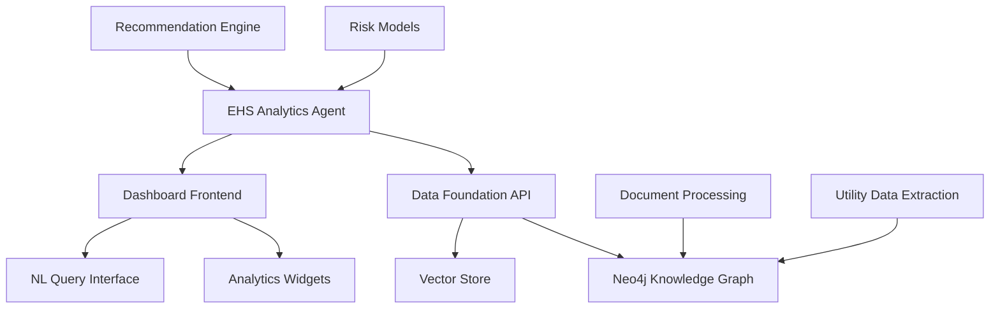

# EHS Analytics Agent - Project Structure

## Overview

The EHS Analytics Agent is a sophisticated AI system built on LangGraph/LangChain architecture that provides intelligent Environmental, Health, and Safety (EHS) data analytics. It extends the existing data-foundation project with advanced agentic RAG capabilities, predictive risk assessment, and actionable recommendation generation.

## Directory Tree

```
ehs-analytics/
├── src/
│   ├── __init__.py
│   ├── agents/
│   │   ├── __init__.py
│   │   ├── query_router.py          # Query analysis and intent routing
│   │   ├── rag_agent.py             # RAG orchestration and coordination
│   │   ├── risk_agent.py            # Risk assessment and prediction
│   │   └── recommendation_agent.py   # Recommendation generation and scoring
│   ├── retrieval/
│   │   ├── __init__.py
│   │   ├── orchestrator.py          # Strategy coordination and result fusion
│   │   └── strategies/
│   │       ├── __init__.py
│   │       ├── graph_query.py       # Neo4j Cypher query strategy
│   │       ├── vector_search.py     # Vector similarity search
│   │       ├── graph_traversal.py   # Multi-hop graph relationship queries
│   │       └── temporal_query.py    # Time-series analysis and trends
│   ├── risk_assessment/
│   │   ├── __init__.py
│   │   ├── scoring.py               # Multi-factor risk scoring methodology
│   │   ├── thresholds.py            # Dynamic threshold management
│   │   └── algorithms/
│   │       ├── __init__.py
│   │       ├── water_risk.py        # Water consumption anomaly detection
│   │       ├── energy_risk.py       # Electricity usage pattern analysis
│   │       └── waste_risk.py        # Waste generation trend monitoring
│   ├── recommendations/
│   │   ├── __init__.py
│   │   ├── rule_engine.py           # Template-based recommendation rules
│   │   ├── ml_recommendations.py    # ML-based predictive suggestions
│   │   ├── cost_benefit.py          # Economic impact and ROI analysis
│   │   └── insights.py              # Actionable insight synthesis
│   ├── workflows/
│   │   ├── __init__.py
│   │   ├── analytics_workflow.py    # LangGraph orchestration workflows
│   │   └── state_management.py      # Workflow state and context management
│   ├── models/
│   │   ├── __init__.py
│   │   ├── query_models.py          # Query and response data models
│   │   ├── risk_models.py           # Risk assessment data structures
│   │   └── recommendation_models.py # Recommendation and insight models
│   ├── api/
│   │   ├── __init__.py
│   │   ├── analytics_router.py      # FastAPI endpoints for analytics
│   │   └── middleware.py            # Request/response processing middleware
│   └── utils/
│       ├── __init__.py
│       ├── config.py                # Configuration management
│       ├── logging.py               # Structured logging setup
│       └── performance.py           # Performance monitoring utilities
├── tests/
│   ├── __init__.py
│   ├── unit/
│   │   ├── __init__.py
│   │   ├── test_agents/
│   │   │   ├── test_query_router.py
│   │   │   ├── test_rag_agent.py
│   │   │   ├── test_risk_agent.py
│   │   │   └── test_recommendation_agent.py
│   │   ├── test_retrieval/
│   │   │   ├── test_orchestrator.py
│   │   │   └── test_strategies/
│   │   │       ├── test_graph_query.py
│   │   │       ├── test_vector_search.py
│   │   │       ├── test_graph_traversal.py
│   │   │       └── test_temporal_query.py
│   │   ├── test_risk_assessment/
│   │   │   ├── test_scoring.py
│   │   │   ├── test_thresholds.py
│   │   │   └── test_algorithms/
│   │   │       ├── test_water_risk.py
│   │   │       ├── test_energy_risk.py
│   │   │       └── test_waste_risk.py
│   │   └── test_recommendations/
│   │       ├── test_rule_engine.py
│   │       ├── test_ml_recommendations.py
│   │       ├── test_cost_benefit.py
│   │       └── test_insights.py
│   ├── integration/
│   │   ├── __init__.py
│   │   ├── test_workflow_integration.py
│   │   ├── test_api_integration.py
│   │   └── test_data_foundation_integration.py
│   └── e2e/
│       ├── __init__.py
│       ├── test_complete_analytics_flow.py
│       └── test_dashboard_integration.py
├── docs/
│   ├── README.md                    # Project overview and getting started
│   ├── IMPLEMENTATION_PLAN.md       # Detailed implementation roadmap
│   ├── PROJECT_STRUCTURE.md         # This document
│   ├── API.md                       # API documentation and endpoints
│   ├── DEPLOYMENT.md                # Deployment and operations guide
│   ├── ARCHITECTURE.md              # Technical architecture details
│   └── examples/
│       ├── query_examples.md        # Sample queries and responses
│       ├── risk_assessment_examples.md
│       └── recommendation_examples.md
├── scripts/
│   ├── setup_development.py         # Development environment setup
│   ├── run_tests.py                 # Test execution script
│   ├── performance_benchmark.py     # Performance testing utilities
│   └── data_migration.py            # Data setup and migration scripts
├── config/
│   ├── development.yaml             # Development configuration
│   ├── production.yaml              # Production configuration
│   └── test.yaml                    # Test environment configuration
├── requirements.txt                 # Python dependencies
├── pyproject.toml                   # Poetry configuration and metadata
├── Dockerfile                       # Container configuration
├── docker-compose.yml               # Local development orchestration
├── .env.example                     # Environment variables template
├── .gitignore                       # Git ignore patterns
└── README.md                        # Project overview
```

## Directory Descriptions

### `/src/` - Core Application Code

**Purpose**: Contains all production application code organized by functional domains.

#### `/src/agents/`
- **Purpose**: LangGraph agent implementations that orchestrate different aspects of EHS analytics
- **Key Components**:
  - `query_router.py`: Analyzes natural language queries and routes to appropriate agents
  - `rag_agent.py`: Orchestrates multi-strategy retrieval and response synthesis
  - `risk_agent.py`: Performs predictive risk assessment using ML algorithms
  - `recommendation_agent.py`: Generates actionable recommendations with cost-benefit analysis

#### `/src/retrieval/`
- **Purpose**: Multi-strategy retrieval system for intelligent information access
- **Key Components**:
  - `orchestrator.py`: Coordinates multiple retrieval strategies and fuses results
  - `/strategies/`: Individual retrieval approaches (graph, vector, temporal, traversal)
- **Integration**: Leverages existing Neo4j knowledge graph from data-foundation

#### `/src/risk_assessment/`
- **Purpose**: Predictive analytics for environmental compliance and operational risks
- **Key Components**:
  - `scoring.py`: Multi-factor risk scoring with business impact weighting
  - `thresholds.py`: Dynamic threshold management and adaptation
  - `/algorithms/`: Domain-specific risk assessment algorithms for water, energy, waste

#### `/src/recommendations/`
- **Purpose**: Actionable recommendation generation with economic justification
- **Key Components**:
  - `rule_engine.py`: Template-based recommendations for common scenarios
  - `ml_recommendations.py`: Machine learning-based suggestion system with effectiveness tracking
  - `cost_benefit.py`: ROI analysis and economic impact assessment
  - `insights.py`: Natural language insight synthesis and stakeholder routing

#### `/src/workflows/`
- **Purpose**: LangGraph workflow orchestration and state management
- **Key Components**:
  - `analytics_workflow.py`: Main workflow definitions and agent coordination
  - `state_management.py`: Workflow state persistence and context management

#### `/src/models/`
- **Purpose**: Pydantic data models for type safety and validation
- **Key Components**:
  - `query_models.py`: Request/response models for analytics queries
  - `risk_models.py`: Risk assessment data structures and scoring models
  - `recommendation_models.py`: Recommendation and insight data models

#### `/src/api/`
- **Purpose**: FastAPI REST endpoints for dashboard and external integrations
- **Key Components**:
  - `analytics_router.py`: Main analytics API endpoints
  - `middleware.py`: Authentication, rate limiting, and request processing

#### `/src/utils/`
- **Purpose**: Shared utilities and cross-cutting concerns
- **Key Components**:
  - `config.py`: Configuration management and environment handling
  - `logging.py`: Structured logging with performance tracking
  - `performance.py`: Monitoring and alerting utilities

### `/tests/` - Test Suite

**Purpose**: Comprehensive testing strategy with unit, integration, and end-to-end tests.

#### `/tests/unit/`
- **Purpose**: Isolated component testing with mocked dependencies
- **Coverage**: All core components with >90% code coverage target

#### `/tests/integration/`
- **Purpose**: Component interaction testing and data-foundation integration
- **Key Tests**:
  - Workflow orchestration between agents
  - API endpoint integration
  - Database connection and query execution

#### `/tests/e2e/`
- **Purpose**: Full system testing with real data and complete workflows
- **Scenarios**: Complete analytics queries from natural language to recommendations

### `/docs/` - Documentation

**Purpose**: Comprehensive project documentation for developers, operators, and users.

#### Key Documents
- `README.md`: Quick start guide and project overview
- `IMPLEMENTATION_PLAN.md`: Detailed technical implementation roadmap
- `API.md`: REST API documentation with examples
- `DEPLOYMENT.md`: Production deployment and operations guide
- `ARCHITECTURE.md`: Technical architecture and design decisions

### `/scripts/` - Automation and Utilities

**Purpose**: Development, testing, and operational automation scripts.

### `/config/` - Configuration Management

**Purpose**: Environment-specific configuration files with sensitive data externalized.

## Key Files and Their Roles

### Core Application Files

| File | Role | Dependencies |
|------|------|-------------|
| `src/agents/query_router.py` | Natural language query analysis and intent classification | LangChain, spaCy/NLTK |
| `src/agents/rag_agent.py` | Multi-strategy retrieval orchestration | LangGraph, retrieval strategies |
| `src/retrieval/orchestrator.py` | Strategy coordination and result fusion | All retrieval strategies |
| `src/workflows/analytics_workflow.py` | LangGraph workflow definitions | All agents, state management |
| `src/api/analytics_router.py` | FastAPI endpoints for analytics | Workflow orchestrator, models |

### Configuration Files

| File | Purpose | Environment |
|------|---------|------------|
| `requirements.txt` | Python dependency specification | All |
| `pyproject.toml` | Poetry configuration and project metadata | Development |
| `docker-compose.yml` | Local development orchestration | Development |
| `Dockerfile` | Container configuration | Production |

### Data Models

| File | Models | Purpose |
|------|--------|---------|
| `src/models/query_models.py` | `AnalyticsQuery`, `AnalyticsResponse` | API request/response validation |
| `src/models/risk_models.py` | `RiskAssessment`, `RiskIndicator` | Risk assessment data structures |
| `src/models/recommendation_models.py` | `Recommendation`, `ActionableInsight` | Recommendation system models |

## Integration Points with Data-Foundation

### Database Integration

**Neo4j Knowledge Graph**
- **Connection**: Shared Neo4j instance at `neo4j://localhost:7687`
- **Schema**: Extends existing graph schema with analytics-specific nodes and relationships
- **Access Pattern**: Read-heavy with analytical queries, minimal writes

**Data Sources**
- **Utility Bills**: Water, electricity consumption data from `/data-foundation/data/`
- **Waste Manifests**: Waste generation and disposal records
- **Permits**: Regulatory compliance documents and limits

### API Integration

**Existing Endpoints**
- **Base URL**: Extends `/data-foundation/web-app/backend/`
- **New Routes**: Adds `/api/analytics/` router to existing FastAPI application
- **Authentication**: Leverages existing auth middleware

**Dashboard Integration**
- **Frontend**: Enhances existing React dashboard at `/data-foundation/frontend/`
- **Components**: Adds analytics widgets and natural language query interface
- **State Management**: Integrates with existing React context providers

### Data Flow Architecture



### Shared Dependencies

**Python Packages**
- `neo4j`: Database connectivity
- `fastapi`: Web framework
- `pydantic`: Data validation
- `llama-index`: Document indexing (shared vector store)
- `langchain`: LLM orchestration

**Infrastructure**
- **Neo4j Database**: Shared graph database instance
- **Vector Store**: Shared embeddings and document chunks
- **LLM Services**: Shared OpenAI/Anthropic API keys
- **Monitoring**: Shared logging and metrics infrastructure

## Development Workflow

### Getting Started

1. **Environment Setup**
   ```bash
   cd /Users/eugene/dev/ai/agentos/ehs-ai-demo/ehs-analytics
   python3 -m venv venv
   source venv/bin/activate
   pip install -r requirements.txt
   ```

2. **Configuration**
   ```bash
   cp .env.example .env
   # Edit .env with database credentials and API keys
   ```

3. **Database Connection**
   ```bash
   # Ensure data-foundation Neo4j is running
   cd ../data-foundation
   docker-compose up neo4j
   ```

4. **Development Server**
   ```bash
   python -m uvicorn src.api.analytics_router:app --reload
   ```

### Testing Strategy

**Unit Tests**
```bash
python -m pytest tests/unit/ -v --cov=src/
```

**Integration Tests**
```bash
python -m pytest tests/integration/ -v
```

**End-to-End Tests**
```bash
python -m pytest tests/e2e/ -v --integration
```

### Code Organization Principles

1. **Single Responsibility**: Each module has a clear, focused purpose
2. **Dependency Injection**: Components receive dependencies rather than creating them
3. **Interface Segregation**: Clear interfaces between agents and strategies
4. **Configuration Management**: Environment-specific settings externalized
5. **Error Handling**: Comprehensive error handling with graceful degradation

This project structure provides a solid foundation for building a sophisticated EHS analytics system that integrates seamlessly with the existing data-foundation infrastructure while maintaining clear separation of concerns and scalability for future enhancements.